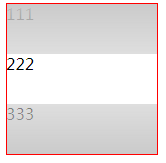
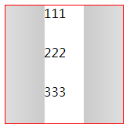
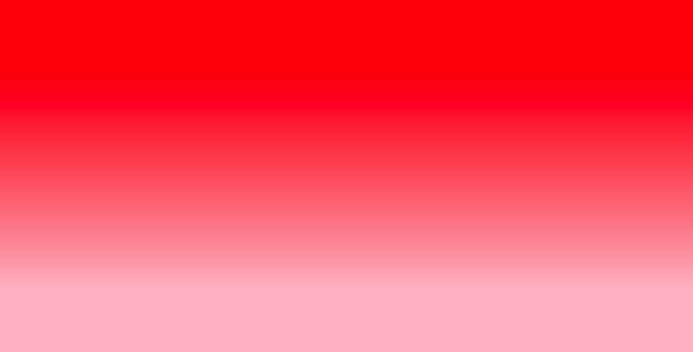
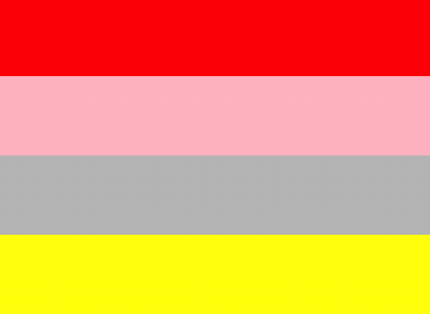
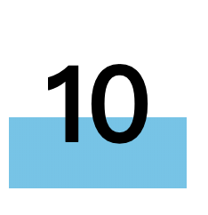

::: tip 总结
1. 屏幕大小

xl: ≥1920px 

lg: 一般用于大屏设备（min-width：1200px）

md: 一般用于中屏设备（min-width：992px）

sm: 一般用于小屏设备（min-width：768px）

xs: 用于超小型设备（max-width：768px）
:::
## flex

参考：[菜鸟教程](https://www.runoob.com/cssref/css3-pr-flex.html)
[MDN](https://developer.mozilla.org/zh-CN/docs/Web/CSS/flex)

flex: flex-grow flex-shrink flex-basis（由这三部分构成）

flex-grow: 扩展量，数字，默认值为0，负数无效。

flex-shrink: 收缩量，数字，默认值为1，负数无效。

flex-basis: 带单位的数值，默认值为auto，如果设置为0需要加单位，避免被视作伸缩性。

<p class="fr_t">值：</p>

1. flex: auto 等价于 flex: 1 1 auto

2. flex: initial （默认值）等价于 0 1 auto

3. flex: inherit 继承自父元素

4. flex: none 等价于 0 0 auto

<p class="fr_t">单值语法：</p>

1. 一个无单位数，视作flex-grow的值。
2. 一个有效的宽度值，视作flex-basis的值。
3. 关键词 none、initial、auto。

<p class="fr_t">双值语法：</p>

第一个值必须为无单位数，视为flow-grow的值，第二个数：

1. 一个无单位数，视作flex-shrink的值。
2. 一个有效的宽度值，视作flex-basis的值。

<p class="fr_t">三值语法：</p>

1. 一个无单位数，视作flex-grow的值。
1. 一个无单位数，视作flex-shrink的值。
2. 一个有效的宽度值，视作flex-basis的值。

例：
```html
<style>
  .wrap {
    display: flex;
    height: 100px;
    width: 600px;
  }
  .item1 {
    flex: 1 1 100px;
    background-color: pink;
  }
  .item2 {
    flex: 1 1 200px;
    background-color: skyblue;
  }
</style>
<div class="wrap">
  <div class="item1"></div>
  <div class="item2"></div>
</div>
```
此时 item1 宽度为 250px，item2 宽度为 350px 。
计算方式：

item1 -> flex-basis为 100px，可扩展，可收缩。
item2 -> flex-basis为 200px，可扩展，可收缩。

基于flex-basis剩余 600 - 100 - 200 = 300px，再将其均分。

若将 item1设为 flex: 1 1 auto，则此时宽度分别为 200px、400px。

若将 item1 设为 flex: 1 1 auto，并且其div中写入部分内容，则此时 item1 的宽度为： 

<p class="fr_th">内容宽度 + (600 - 200 - 内容宽度) / 2</p>


```html
<style>
.box {
  display: flex;
  background-color: seagreen;
  width: 200px;
  height: 50px;
}

/* 第一种 
* 此时该元素宽度为125px
* 计算方式：可用空间 200 - 100 - 50 = 50，可扩展：50 * 0.5 = 25，总宽度为：100 + 25 = 125
*/
.item:first-child {
  background-color: skyblue;
  flex-grow: 0.5;
  flex-basis: 100px;
  width: 10px;
}

/* 第二种 
* 此时该元素宽度为125px
* 计算方式：可用空间 200 - 10 - 50 = 140，可扩展：140 * 0.5 = 70，总宽度为：10 + 70 = 80
*/
.item:first-child {
  background-color: skyblue;
  flex-grow: 0.5;
  width: 10px;
}

.item:last-child {
  width: 50px;
  background-color: firebrick;
}
</style>
<body>
  <div class="box">
    <div class="item"></div>
    <div class="item"></div>
  </div>
</body>
```

### justify-content: space-evenly无效

justify-content: space-evenly，使每个元素之间的间距一致。

justify-content: space-around，使第一个元素和最后一个元素与边界的距离等于其它元素之间距离的一半。

```html
<!-- 解决办法，使用伪元素替代 -->
<style>
.box {
  display: flex;
  justify-content: space-between;
  width: 300px;
  height: 80px;
  background-color: pink;
}
.box>div:nth-of-type(1) {
  width: 60px;
  background-color: skyblue;
}
.box>div:nth-of-type(2) {
  width: 60px;
  background-color: seagreen;
}
.box>div:nth-of-type(3) {
  width: 60px;
  background-color: firebrick;
}
.box::before, .box::after {
  content: "";
}
</style>
<body>
  <div class="box">
    <div></div>
    <div></div>
    <div></div>
  </div>
</body>
```
## 2D 和 3D 转化

### transform

transform适用于：所有块级元素及某些内联元素(如：button)。

:::tip 规则
A transformable element is an element in one of these categories:
an element whose layout is governed by the CSS box model which is either a block-level or atomic inline-level element, or whose display property computes to table-row, table-row-group, table-header-group, table-footer-group, table-cell, or table-caption [CSS21]
an element in the SVG namespace and not governed by the CSS box model which has the attributes transform, ‘patternTransform‘ or gradientTransform[SVG11].
:::

例：未设置宽度的块级元素设置了 transform: translateX(100px); 该元素在水平方向上会出现滚动条。

```html
<!--例-->
<style>
  span {
    display: inline-block; 
    transform: rotate(45deg); // 生效
  }
</style>
<body>
  <span>222</span>
</body>
```
## background

### 实现上下蒙层，中间内容展示。

```html
<style>
  .wrap {
    position: relative;
  }
  .mask {
    position: absolute;
    top: 0;
    left: 0;
    height: 150px;
    width: 150px;
    border: 1px solid red;
    background-image: linear-gradient(to bottom, rgba(200,200,200,0.95), rgba(200,200,200,0.6)),
linear-gradient(to top, rgba(200,200,200,0.95), rgba(200,200,200,0.6));
    background-repeat: no-repeat;
    background-position: top, bottom;
    background-size: 100% 50px;
  }
  .content div {
    height: 50px;
  }
</style>
</head>
<body>
  <div class="wrap">
    <div class="mask"></div>
    <div class="content">
      <div>111</div>
      <div>222</div>
      <div>333</div>
    </div>
  </div>
</body>
```


### 实现左右蒙层

```html
<style>
  .wrap {
    position: relative;
  }
  .mask {
    position: absolute;
    top: 0;
    left: 0;
    height: 150px;
    width: 150px;
    border: 1px solid red;
    background-image: linear-gradient(to left, rgba(200,200,200,0.95), rgba(200,200,200,0.6)),
linear-gradient(to right, rgba(200,200,200,0.95), rgba(200,200,200,0.6));
    background-repeat: no-repeat;
    background-position: left, right;
    background-size: 50px 100%;
  }
  .content div {
    margin-left: 50px;
    height: 50px;
  }
</style>
</head>
<body>
  <div class="wrap">
    <div class="mask"></div>
    <div class="content">
      <div>111</div>
      <div>222</div>
      <div>333</div>
    </div>
  </div>
</body>
```


### line-gradient

line-gradient默认为垂直渐变。

#### 设置百分比的用法

```css
background-image: linear-gradient(red 20%, pink 80%);
/* 从顶端开始20%的空间填充red，距离顶端80%时开始填充pink，剩下的60%填充渐变色 */
```


百分比设置规则：
1. 默认第一个颜色从顶端开始着色，其它颜色从距离顶端的百分比距离填充实色，剩余的空间填充渐变色。
2. 如果后面设置的百分比小于前面的值，则该值会被当成前面所有值中的最大值。

```css
background-image: linear-gradient(red, pink);
/* 等价于: */
background-image: linear-gradient(red 0%, pink 100%);

background-image: linear-gradient(red, pink, green, silver, blue);
/* 等价于: */
background-image: linear-gradient(red 0%, pink 25%, green 50%, silver 75%, blue 100%);
```
实现多重线条效果：

```css
background:linear-gradient(
  red 0%,
  red 25%,
  pink 25%,
  pink 50%,
  silver 50%,
  silver 75%,
  yellow 75%,
  yellow 100%
);
```


例：
```html
<style>
.price {
  width: 100px;
  height: 80px;
  padding: 10px 0;
  font-size: 60px;
  font-weight: bold;
  background-image: linear-gradient(transparent 60%, skyblue 60%);
  text-align: center;
}
</style>
<div class="price">10</div>
```


### radial-gradient

#### 实现卡券效果

```html
<!DOCTYPE html>
<html lang="en">
<head>
    <meta charset="UTF-8">
    <meta name="viewport" content="width=device-width, initial-scale=1.0">
    <title>Document</title>
</head>
<style>
body {
  background: #aaa;
}
.coupon {
  width: 300px;
  height: 100px;
  background: radial-gradient(circle at right bottom, transparent 10px, #fff 11px) top right / 50% 50px no-repeat,
    radial-gradient(circle at left bottom, transparent 10px, #fff 11px) top left / 50% 50px no-repeat,
    radial-gradient(circle at right top, transparent 10px, #fff 11px) bottom right / 50% 50px no-repeat,
    radial-gradient(circle at left top, transparent 10px, #fff 11px) bottom left / 50% 50px no-repeat;
  filter: drop-shadow(2px 2px 2px rgba(0, 0, 0, .2));
}
.radial-gradient {
  margin: 30px 0 0 30px;
  width: 200px;
  height: 80px;
  position: relative;
  background-image: radial-gradient(circle at right top, #aaa 10px, transparent 11px), radial-gradient(circle at right bottom, #aaa 10px, transparent 11px);
  background-color: #fff;
}
.radial-gradient::after {
  content: "";
  position: absolute;
  top: 0;
  left: -5px;
  bottom: 0;
  width: 10px;
  background: radial-gradient(10px 12px ellipse, #fff 4px, transparent 5px);
  background-size: 10px 10px;
}
.radial-gradient1::after {
  content: "";
  position: absolute;
  top: 0;
  left: -5px;
  bottom: 0;
  width: 10px;
  background: radial-gradient(10px 12px ellipse, #aaa 4px, transparent 5px);
  background-size: 10px 10px;
}
.coupon2 {
  margin: 30px 0 0 30px;
  width: 300px;
  height: 100px;
  background: radial-gradient(circle at right center, #aaa 10px, transparent 11px),
    radial-gradient(circle at left center, #aaa 10px, #fff 11px);
}
.coupon3 {
  position: relative;
  margin: 30px 0 0 30px;
  width: 300px;
  height: 100px;
  background: radial-gradient(circle at center top, #aaa 10px, transparent 11px),
    radial-gradient(circle at center bottom, #aaa 10px, #fff 11px);
}
.coupon3::after {
  content: "";
  position: absolute;
  top: 0;
  left: -5px;
  bottom: 0;
  width: 10px;
  background: radial-gradient(10px 12px ellipse, #aaa 4px, transparent 5px);
  background-size: 10px 10px;
}
</style>
<body>
    <div class="coupon"></div>
    <div class="radial-gradient"></div>
    <div class="radial-gradient radial-gradient1"></div>
    <div class="coupon2"></div>
    <div class="coupon3"></div>
</body>
</html>
```

## css变量

1. css变量使用 --name 表示。
2. 使用 var() 函数引用变量。
3. 变量名区分大小写，--color 和 --Color 不是同一个变量。
4. var()函数第二个参数表示默认值：var(--colorr, pink)。
5. 变量值只能用作属性值，不能用作属性名。
6. 如果变量值是数值，不能与数值单位直接连用。

```css
/* 例1 */
:root {
  --color: red;
}
@supports (--color: red) {
  div {
    color: var(--color);
  }
}
@supports not (--color: red) { /* not 和 ( 之间必须有一个空格 */
  div {
    color: skyblue;
  }
}

/* 例2 */
.red {
  --color: color;
  var(--color): red; /* 不合法 */
}

/* 例3 */
.gap {
  --gap: 20;
  margin-top: var(--gap)px; /* 无效 */
  margin-top: calc(var(--gap) * 1px); /* right */
}
```

## css选择器

### first-of-type

p:first-of-type：表示 p 元素所在的父元素下的第一个为 p 元素的子元素。

```html
<style type="text/css">
div .h2:first-of-type { /*设置无效*/
  color: red;
}
div :first-of-type { /*作用于第一个h1元素和第一个p元素*/
  color: red;
}
</style>

<body>
  <div>
    <h1 class="h1">标题1</h1>
    <h1 class="h2">标题2</h1>
    <h1 class="h2">标题2</h1>
    <p class="p1">段落1</p>
    <p class="p2">段落2</p>
  </div>
</body>
```
#### div .h2:first-of-type 设置无效的原因分析：

div .h2:first-of-type会查找.h2类名所对应的元素，这里是h1元素，所以:first-of-type会匹配第一个h1元素，也就是说，这里的class类名只是找到对应元素类型的作用。接下来结合起来看，第一个h1的元素的class并不是.h2，所以就无法匹配到。

#### 选择第一个 h1.h2 的方法

```css
div .h2 {
  color: red;
}
div .h2~.h2 {
  color: skyblue;
}
```
### element1~element2

例： a~b 表明选择a元素之后的每个b元素,其中a元素和b元素为兄弟元素。

### only-of-type

p:only-of-type：表明选择当前父元素下有且仅有一个p元素。

div :only-of-type：表明选择父元素div下的有且仅有一个同类子元素。

```html
<style>
div :only-of-type {
	background: #ff0000; /*选中p元素和h1元素*/
}
</style>
<div>
  <p>1111</p>
  <span>2222></span>
  <h1>3333</h1>
  <span>4444</span>
</div>
<div>5555</div> <!--css不作用于该元素-->
```

### css根据列表li个数设置不同样式

[参考](https://www.zhangxinxu.com/wordpress/2019/03/nth-last-child-css-layout/)

```css
li:only-child { /* 1个li */ }
li:first-child:nth-last-child(2) { /* 2个li */ }
li:first-child:nth-last-child(3) { /* 3个li */ }
```

li:first-child:nth-last-child(2)：li:first-child表明选择的是第一个li元素，并且这个元素又是从后往前的第二个元素。因此当前的li元素只有两个。

```css
/* 3个li项目的第1个列表项 */
li:first-child:nth-last-child(3) {}
/* 3个li项目的第1个列表项的后一个，也就是第2项的样式 */
li:first-child:nth-last-child(3) + li {}
/* 3个li项目的第一个列表项后面两个列表项，也就是第2项和第3项的样式 */
li:first-child:nth-last-child(3) ~ li {}
```

### :root 和 html 元素的区别

```
The :root pseudo-class represents an element that is the root of the document. In HTML 4, this is always the HTML element.
```

1. :root 指文档的根元素，对于 html 文档来说，:root 就是 html 元素
2. 优先级不同：:root > html

### :not 

:not伪类不像其它伪类，它不会增加选择器的优先级。

```html
<style>
h1#a { // 1 + 100
	color: silver;
}
h1:not(#b) { // 1 + 100
    color: red;
}
</style>
<h1 class="a" id="a">这是一个标题</h1> <!-- red -->

```

### 属性选择器

~= *= |= ^= $=

1. ~=：匹配属性值中按空格分隔的词
2. *=：属性值中包含该词（包含 ~= 的功能)
3. |=：匹配该值或该值后有 - 的词
4. ^=：匹配以该值开头的属性值
5. $=：匹配以该值结尾的属性值

```html
<!-- [attribute~=value] -->
<style>
p[class~="t1"] {
  color: red;
}
p[class~="t"] {
  color: silver;
}
</style>
<p class="t1 t2">11</p> <!-- red -->
<p class="t3">11</p> <!-- red -->

<!-- [attribute*=value] -->
<style>
p[class*="t"] {
  color: silver;
}
</style>
<p class="t1 t2">11</p> <!-- silver -->
<p class="t3">11</p> <!-- silver -->

<!-- [attribute|=value] -->
<style>
p {
  color: red;
}
p[class|="t"] {
  color: silver;
}
</style>
<p class="t1 t2">11</p> <!-- red -->
<p class="t">11</p> <!-- silver -->
<p class="t-11">11</p> <!-- silver -->
<p class="t2">11</p> <!-- red -->

<!-- [attribute^=value] -->
<style>
p {
  color: red;
}
p[class^="t"] {
  color: silver;
}
</style>
<p class="t1">11</p> <!-- silver -->
<p class="1t">11</p> <!-- red -->

<!-- [attribute$=value] -->
<style>
p {
  color: red;
}
p[class$="t"] {
  color: silver;
}
</style>
<p class="t1">11</p> <!-- red -->
<p class="1t">11</p> <!-- silver -->
```

### :focus

获得焦点的元素：input textarea 和 select

### :first-child :last-child

p:first-child：表示 p 元素所在的父元素下的第一个子元素并且该元素为 p 元素（如果第一个子元素不为 p 元素则设置无效）。

### :nth-child(n) :nth-last-child(n)

p:nth-child(2)：选择 p 元素所在的父元素下的第二个子元素并且该元素为 p 元素

### :only-child

p:only-child：表示 p 元素所在的父元素下有且仅有一个元素，并且该元素为 p 元素

### :first-of-type :last-of-type

p:first-of-type：选择 p 元素所在的父元素下的第一个为 p 元素的子元素

### :nth-of-type(n) :nth-last-of-type(n)

p:nth-of-type(2)：选择 p 元素所在的父元素下的第二个为 p 元素的子元素

### :only-of-type

p:only-of-type：表示 p 元素所在的父元素下有且仅有一个元素，并且该元素为 p 元素

### :first-letter

p:first-letter：表示选择每个 p 元素的第一个字母

### :first-line

p:first-line：表示选择每一个 p 元素的第一行内容

### :empty

p:empty：选择没有任何子集的p元素（包括文本节点，即为一个空的p标签）

### :target

用于锚点跳转，选择当前活动的元素

```html
<style>
p[id*="pos"]:target {
  background: skyblue;
}
</style>

<a href="#pos1">跳转到pos1</a>
<p id="pos1">this is pos1</p> <!-- 点击后变更背景色 -->
<a href="#pos2">跳转到pos2</a>
<p id="pos2">this is pos2</p> <!-- 点击后变更背景色 -->
```

### ::selection

作用于被选中的文本

### :in-range :out-of-range

:in-range：匹配值在指定区间之内的 input 元素

:out-of-range：匹配值在指定区间之外的 input 元素

配合 input 元素的 min 属性和 max 属性使用

```html
<style>
input {
  border: none;
  outline: none;
  margin: 0;
  height: 60px;
  line-height: 60px;
  padding: 0 10px;
  font-size: 30px;
}
input:in-range {
  background: seagreen;
}
input:out-of-range {
  background: skyblue;
}
input:in-range + label::after{
  content: 'in range';
}
input:out-of-range + label::after{
  content: 'out of range'
}
</style>
<div class="wrap">
  <input id="number" type="number" value="6" min="5" max="10"/>
  <label for="number"></label>
</div>
```

### :read-write :read-only

:read-write：用于匹配可读及可写的元素（没有设置 readonly属性的元素。在大多浏览器中, :read-write 选择器只使用于设置了input 和 textarea 元素）

:read-only：用于匹配设置 "readonly"（只读） 属性的元素

### :optional

没有设置 "required" 属性的元素。只适用于表单元素: input, select 和 textarea。

### :valid :invalid

:valid：匹配输入值为合法的元素

:invalid：匹配输入值为非法的元素

如：校验email 字段，input 元素中的 min 和 max 属性中输入的值是否合法等。

## 使用 css 管理事件

[摘自](https://segmentfault.com/a/1190000019342789)

### 事件禁用

1. disabled

```html
<style>
button:disabled { /* 设置禁用的样式 */
  color: skyblue;
}
</style>
<button disabled>click</button>
```
2. 禁用div等本身不具备disabled属性的元素

```html
<style>
div {
  cursor: pointer;
}
div.disabled {
  pointer-events: none;
}
</style>
<div class="disabled">click</div>
```
### 实现长按操作

```html
<style>
button:active {
  opacity: 0.99;
  transition: opacity 1s;
}
</style>

<button id="btn">click</button>
```
```js
var btn = document.getElementById('btn')
btn.addEventListener('transitionend', function () {
  console.log('long press')
})
```

### border-radius

<p class="fr_t">为什么设置 border-radius: 50% 和 border-radius: 100% 的效果一致。</p>

[参考](https://www.jianshu.com/p/0ad8e145bd82)

<p class="fr_t">border-radius 设置百分比作用机制</p>

四个角：

1. border-top-left-radius
2. border-top-right-radius
3. border-bottom-right-radius
4. border-bottom-left-radius

例：

```css
.wrap {
  width: 200px;
  height: 100px;
  background-color: skyblue;
  border-top-left-radius: 50%;
}
```
此时设置的是左上角的圆角，水平方向为 width 的 50%，竖直方向为 height 的 50%，此时的圆弧为椭圆的圆弧。水平方向的大小为短半径，竖直方向的大小为长半径。

## 动画

### transition

作用机制：需要一个初始化的属性，当其发生变化时才能触发过渡效果。

transition失效：display: none -> display:block，当初始属性为 display: none，浏览器读不到这个初始属性，所以当其变化为 display: block时，不会产生过渡效果。

transition后面不要跟all，因为会造成浏览器大量的计算资源，可能会导致页面卡顿。

#### 常见闪动的解决办法

使用3d元素开启硬件减速。

perpective、backface-visibility

```html
<style>
.box {
  width: 100px;
  height: 100px;
  transition: width 2s;
  background-color: #000;
  /* transform: translateZ(0); */
}
.box:hover {
  width: 500px;
}
</style>
<body>
  <div class="box"></div>
</body>
```

### animation

step：作用于每个关键帧，而不是整个时间。

```html
<style>
@keyframes run {
  100% {
    background-position-x: -2400px;
  }
}
.rabbit {
  width: 200px;
  height: 200px;
  background: url("./images/rabbit.png") no-repeat;
  animation: run .5s steps(12) infinite;
}
</style>
<div class="rabbit"></div>
```

```html
<style>
@keyframes run {
  50% {
    background-position-x: -1200px;
  }
  100% {
    background-position-x: -2400px;
  }
}
.rabbit {
  width: 200px;
  height: 200px;
  background: url("./images/rabbit.png") no-repeat;
  animation: run .5s steps(6) infinite;
}
</style>
<div class="rabbit"></div>
```

## table

### 实现头部固定，内容滚动的布局

```html
<!DOCTYPE html>
<html lang="en">
<head>
  <meta charset="UTF-8">
  <meta name="viewport" content="width=device-width, initial-scale=1.0">
  <title>Document</title>
</head>
<style>
* {
  margin: 0;
  padding: 0;
}
.content {
  max-width: 400px;
}
table {
  display: block;
  border-collapse: collapse;
  border-spacing: 0;
  overflow-x: auto;
}
/* thead {
  display: table;
  width: 100%;
} */
tbody {
  display: inline-block; /* 不可设置display:block，会导致竖直方向上的滚动条位置异常 */
  max-height: 200px;
  overflow-y: scroll;
}
th {
  min-width: 200px; /* 必须同时设置min-width和max-width，直接设置width无效 */
  max-width: 200px;
  text-align: left;
}
td {
  min-width: 200px;
  max-width: 200px;
  padding: 10px 0;
}
.w100 {
  min-width: 100px;
  max-width: 100px;
}
</style>
<body>
  <div id="app" class="content">
    <table>
      <thead>
        <tr>
          <th>title1</th>
          <th>title2</th>
          <th class="w100">title3</th>
          <th>title4</th>
          <th>title5</th>
        </tr>
      </thead>
      <tbody>
        <tr v-for="item in 20">
          <td>内容一一一一一一</td>
          <td>内容二二二二二</td>
          <td class="w100">内容三</td>
          <td>内容四四四四四四四</td>
          <td>内容五五五五五五五五</td>
        </tr>
      </tbody>
    </table>
  </div>
</body>
<script src="https://unpkg.com/vue/dist/vue.js"></script>
<script>
new Vue({
  el: '#app'
})
</script>
</html>
```

## 字体图标

位图：jpg、png、gif

矢量图：svg

### 使用 font + html 实现字体图标

优点：轻量性、灵活性、兼容性好。是目前广泛使用的技术。

缺点：大多数字体图标只能被渲染为单色。

[图标网站](https://icomoon.io/app/#/select)

项目引入方式：引入 fonts 文件夹和 style.css 文件。

```html
<!--icomoon-->
<link rel="stylesheet" type="text/css" href="css/style.css">
<!-- 使用方式-->
<span class="icon-">&#xe911;</span>
<span class="icon-">&#xe905;</span>
```

### 使用 font + css 实现字体图标

```html
<span class="icon-pacman"></span>
<span class="icon-folder-plus"></span>
<span class="icon-folder-download"></span>
```

### 阿里矢量图标库引入彩色图标

```html
<link rel="stylesheet" type="text/css" href="css/ali-fonts/iconfont.css"/>
<script src="css/ali-fonts/iconfont.js"></script>
<style>
.icon {
  width: 1em;
  height: 1em;
  vertical-align: -0.15em;
  fill: currentColor;
  overflow: hidden;
}
</style>

<!--引入彩色图标-->
<svg class="icon" aria-hidden="true">
  <use xlink:href="#icon-building-type-170000-18"></use>
</svg>
```

注：

1. 彩色图标设置颜色是无效的，但可以通过设置 font-size 改变图标的大小。
2. 彩色图标也可以通过设置 width 和 height 改变图标的大小，但是对单色图标的设置无效(非svg的引入方式)。

