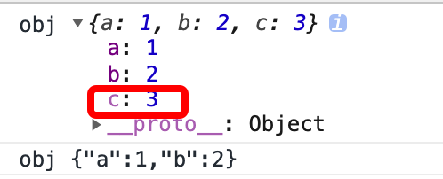

## 基础

### 变量声明

```js
for (var i = 0; i < 10; i++) {
  setTimeout(function() { console.log(i); }, 100 * i);
}
// 输出结果：全为 10

// 期待结果：1，2，3，4...
// 方案一：
for (var i = 0; i < 10; i++) {
  (function(i) {
    setTimeout(function() { console.log(i); }, 100 * i);
  })(i);
}

// 方案二：
for (let i = 0; i < 10 ; i++) {
  setTimeout(function() {console.log(i); }, 100 * i);
}
```
### 箭头函数

箭头函数的 this 总是指向定义生效时所在的对象而不是运行时所在的对象。

理解：只有当函数被调用时，此时其内部的 this 才能被确定，即此时函数中的 this 指向调用的对象。该函数内部的箭头函数的 this 将全部指向该调用者。

```js
// 例1：
/* 箭头函数位于foo函数内部。只有foo函数运行后(被调用后，内部this确定)，
它才会按照定义生成，所以foo运行时所在的对象，恰好是箭头函数定义时所在的对象 */
function foo() {
  setTimeout( () => { // setTimeout 本身是一个函数，只有 foo 被调用后 this 才能确定
    console.log("id:", this.id);
  },100);
}
var id = 21; // 箭头函数运行时所在的环境
foo.call( { id: 42 } ); // 箭头函数定义时所在的环境
// 结果是 id: 42

// 例2：
function foo() {
  return () => {
    return () => {
      return () => {
        console.log("id:", this.id);
      };
    };
  };
}
var f = foo.call({id: 1});
var t1 = f.call({id: 2})()(); // 1
var t2 = f().call({id: 3})(); // 1
var t3 = f()().call({id: 4}); // 1

// 例3：
var a = 10
function test () {
  return function () {
    return () => { // 此处箭头函数生效是在上层函数调用时生效
      console.log(this.a)
    }
  }
}
test.call({a: 1})()() // 10
test().call({a: 1})() // 1
test()().call({a: 1}) // 10

// 例4：
var a = 10
function test () {
  return () => {
    console.log(this.a)
  }
}
test.call({a: 1})() // 1
test().call({a: 1}) // 10

// 例5：
function foo() {
  return () => {
    return () => {
      return () => {
        console.log("id:", this.id);
      };
    };
  };
}
var t0 = foo.call({id: 1})()()(); // 1
var t1 = foo().call({id: 2})()(); // undefined
var t2 = foo()().call({id: 3})(); // undefined
var t3 = foo()()().call({id: 4}); // undefined
// 返回 undefined 表明此时的 this 指向 window

// 例6：
var obj = {
  o: {
    s: () => {
      console.log(this)
    }
  }
}
obj.o.s() // window
// 可以理解：对象中的箭头函数的 this 始终指向 window，无论对象嵌套的层级多深。
```
### 扩展运算符

扩展运算符只能解构对象自身的可枚举属性。

```js
// 例1:
class C {
  p = 12;
  m() { // 挂载在原型上，不可枚举
  }
}
let c = new C();
let clone = { ...c };
clone.p; // ok
clone.m(); // error!

// 例2:
const obj = {a: 1};
Object.defineProperty(obj, 'b', {
  value: function () {
    return 1;
  },
  enumerable: true
})
console.log({...obj}); // {a: 1, b: ƒ}
```

### async 和 await的理解

1. async函数的await命令后面，可以是 Promise 对象和原始类型的值（数值、字符串和布尔值，但这时会自动转成立即 resolved 的 Promise 对象）。
2. 返回值是 Promise。

#### 错误处理

async函数内部抛出错误，会导致返回的 Promise 对象变为reject状态。抛出的错误对象会被catch方法回调函数接收到。

```js
async function test () {
  const res = await 1
  throw new Error(res)
}
test().then(res => console.log(res.message)).catch(err => console.log('err', err.message)).then(console.log)
// err 1
// undefined
```
await命令后面的 Promise 对象如果变为reject状态，则reject的参数会被catch方法的回调函数接收到。

```js
async function test () {
  await Promise.reject('error')
}
test().catch(err => console.log('err', err))
// err error
```
任何一个await语句后面的 Promise 对象变为reject状态，那么整个async函数都会中断执行。

```js
async function test () {
  await Promise.reject('error')
  await Promise.resolve('resolve') // 不会执行
}
test().then(res => console.log('resolve', res))
.catch(err => console.log('err', err))
```

错误处理的两种方式

1. 使用 try {} catch(err) {}
2. 使用 .catch

```js
// 方式一
async function test () {
  try {
    await ajax(url)
  } catch (err) {}
}

// 方式二
async function test () {
  await ajax(url).catch(err => ...)
}
```

#### 请求失败多次请求

```html
<script src="https://unpkg.com/axios/dist/axios.min.js"></script>
<script>
async function ajax(data, count) {
  let response = null
  for (let i = 0; i < count; i++) {
    try {
      response = await axios(data)
      break
    } catch (err) {}
  }
  return response.data
}
ajax({
  url: 'https://icanhazip.com/',
  method: 'get'
}, 3).then(result => {
  console.log('result', result)
})
</script>
```

#### 两个独立的异步操作同时触发

```js
// 方式一
const [res1, res2] = Promise.all([getRes1(), getRes2()])

// 方式二
const res1Promise = getRes1()
const res2Promise = getRes2()
const res1 = await res1Promise
const res2 = await res2Promise
```

#### forEach 函数中使用async函数

```js
function dbFuc(db) { //这里不需要 async
  let docs = [{}, {}, {}];

  // 可能得到错误结果
  docs.forEach(async function (doc) {
    await db.post(doc);
  });
}
```
此时三个db.post操作是并发执行，也就是同时执行，而不是继发执行。正确的写法是采用for循环。

```js
async function dbFuc(db) {
  let docs = [{}, {}, {}];

  for (let doc of docs) {
    await db.post(doc);
  }
}
```
多个请求并发执行

```js
// 方式一
async function dbFuc(db) {
  let docs = [{}, {}, {}];
  let promises = docs.map((doc) => db.post(doc));

  let results = await Promise.all(promises);
  console.log(results);
}

// 方式二

async function dbFuc(db) {
  let docs = [{}, {}, {}];
  let promises = docs.map((doc) => db.post(doc));

  let results = [];
  for (let promise of promises) {
    results.push(await promise);
  }
  console.log(results);
}
```

### promise.all控制任务执行数量

[参考](https://segmentfault.com/a/1190000020992680?utm_source=tag-newest)

要点：使用 iterator 实现

```js
function sleep (time) {
  return new Promise(resolve => setTimeout(resolve, time))
}

async function execute (id) {
  console.log('start', id)
  await sleep(1000)
  console.log('end', id)
}

function promiseLimit(arr, func, count = 1) {
  const iterator = arr.values();
  return new Array(count).fill(iterator).map(async it => {
    for (const value of it) {
      await func(value)
    }
  });
}
/* 每次执行两个任务，当其中一个执行完成，下一个任务开始执行 */
Promise.all(promiseLimit(Array.from({length:10}, (v, i) => i), execute, 2))

/* 每次执行两个任务，当两个任务全部执行完成，执行后面的两个任务 */
async function promiseLimit2(arr, func, count = 1) {
  const iterator = arr.values();
  const taskList = new Array(count).fill(iterator).map(async it => {
    for (const value of it) {
      await func(value)
      break;
    }
  });
  await Promise.all(taskList);
  arr.splice(0, count);
  arr.length && promiseLimit2(arr, execute, count);
}
promiseLimit2(Array.from({length:10}, (v, i) => i), execute, 2)
```

### 其它

#### 多个文件 import 的相同模块里的对象，是否永远都是同一个对象？

vue项目中是的。

[参考](zhihu.com/question/266129549)

## import

```html
<!-- html 文件中使用 import -->

<!-- 方式一： 使用 type="module" -->
<script type="module">
import { data } from './data.js'
console.log('data', data) // {text: "this is data"}
</script>

<!-- 方式二： 使用import函数 (这是一个处于第三阶段的提案) -->
<script>
(async function () {
  const { data } = await import('./data.js')
  console.log('data', data) // {text: "this is data"}
})()
</script>
```

### import require 和 import()

1. import 是编译时加载，require 是运行时加载。
2. import 时ES6的语法，require 是 commonJS的语法，import 可以转化成 require。
3. import 可以导出模块的所有内容或部分内容，而 require 只能导出整个模块对象，不能导出模块的部分内容。
4. import 函数可以动态加载，返回一个promise对象，是异步操作。

## Symbol

::: tip tips
Symbol是一种基本数据类型，它不是对象，因此不能使用new操作符。它是一种类似于字符串的数据类型。可以用来创建一个独一无二的值。

Symbol函数中的参数会被转化成字符串后再生成一个Symbol值。

Symbol 值不能与其他类型的值进行运算。

Symbol值可以转为字符串(toString)或布尔值(Boolean)。

Symbol 作为属性名，遍历对象的时候，该属性不会出现在for...in、for...of循环中，也不会被Object.keys()、Object.getOwnPropertyNames()、JSON.stringify()返回。可以使用Object.getOwnPropertySymbols()方法，获取指定对象的所有 Symbol 属性名。使用 Reflect.ownKeys()方法可以返回所有类型的键名，包括常规键名和 Symbol 键名。
:::

1. for ... in ... ：主要用于遍历对象的可枚举属性，包括自有属性、继承自原型的属性。
2. Object.keys()：返回一个由一个给定对象的自身可枚举属性组成的数组。
3. Object.getOwnPropertyNames()：返回一个由指定对象的所有自身属性的属性名（包括可枚举和不可枚举的属性但不包括Symbol值作为名称的属性）组成的数组。
4. Reflect.ownKeys()：目标对象自身的属性键组成的数组。
5. Object.getOwnPropertySymbols()：返回一个给定对象自身的所有 Symbol 属性的数组。

```js
typeof Symbol() // symbol

// 如果 Symbol 的参数是一个对象，就会调用该对象的toString方法，将其转为字符串，然后才生成一个 Symbol 值
var obj = {toString () {return 123}}
Symbol(obj) // Symbol(123)

var a = Symbol({a: 1, b: 2})
a // Symbol([object Object])

var b = Symbol([1, 2])
b // Symbol(1,2)

// 转为字符串
b.toString() // 'Symbol(1,2)'

// 转为布尔值
Boolean(b) // true

// 获取描述（被转为字符串后的参数值）
Symbol({a: 1, b: 2}).description // '[object Object]'
Symbol('a').description // 'a'
```
### Symbol.for()，Symbol.keyFor()

Symbol.for()：先去全局中查找指定的 key，有则返回，无则新增。

Symbol.keyFor()：返回一个已登记的 Symbol 类型值的key。

#### Symbol.for()与Symbol()的区别：

前者会被登记在全局环境中供搜索，后者不会。Symbol.for() 会先去全局中查找指定的 key 是否存在，如果不存在才会新建一个值。而Symbol每次都会创建一个新的值。

```js
Symbol.for('bar') === Symbol.for('bar') // true
Symbol('bar') === Symbol('bar') // false

let s1 = Symbol.for('foo');
Symbol.keyFor(s1) // 'foo'

let s2 = Symbol('foo');
Symbol.keyFor(s2) // undefined
```

## Set

### 特点

1. 类似于数组
2. 成员唯一，值不重复
3. 参数为具有 iterable 接口的数据（数组，字符串等）
4. 内部值通过类似于 === 判断值是否相等，但在 Set 中 NaN 等于自身，即 NaN 值在 Set 中只能添加一次。
5. Set 结构中键名和键值是同一个值。

```js
const set = new Set(['a', 'b', 'c']) // Set(3) {'a', 'b', 'c'}

/* 等价于 */

const set = new Set()
set.add('a')
set.add('b')
set.add('c')

/* 等价于 */

const set = new Set('abc')
```
### 属性和方法

1. size
2. add(value)
3. delete(value)
4. has(value)
5. clear()

遍历方法：

1. keys()
2. values() （等同于keys()）
3. entries()
4. forEach()

```js
const set = new Set().add({})
let obj1 = null, obj2 = null
for (let item of set.keys()) {
  obj1 = item
}
for (let item of set.values()) {
  obj2 = item
}
obj1 === obj2 // true

var set = new Set().add('a').add('b') 
set.keys() // SetIterator {"a", "b"}
set.values() // SetIterator {"a", "b"}
set.entries() // SetIterator {"a" => "a", "b" => "b"}
```

#### Set 结构的实例默认可遍历，它的默认遍历器生成函数就是它的values方法

```js
const set = new Set().add({})
for (let item of set) {
  console.log(item) // {}
}
Set.prototype[Symbol.iterator] === Set.prototype.values // true
Set.prototype[Symbol.iterator] === Set.prototype.keys // true
```

#### 将 Set 结构转化成数组

```js
// 方式一
[...new Set()] // []

// 方式二
Array.from(new Set()
```

#### 改变 Set 结构中的数据

```js
let set = new Set().add(1).add(2) // Set(2) {1, 2}

// 方式一
set = new Set([...set].map(val => val * 2)) // Set(2) {2, 4}

// 方式二
set = new Set(Array.from(set, val => val * 2)) // Set(2) {2, 4}
```

### 应用

```js
// 数组去重
const arr = [1, 2, 3, 1]
[...new Set(arr)] // [1, 2, 3]

// 字符串去重
[...new Set('aabbcc')].join('') // abc
```

## WeakSet

### 特点

1. 只能存储对象
2. WeakSet 中的对象都是弱引用，垃圾回收机制不考虑 WeakSet 对该对象的引用，只要这些对象在外部消失，它在 WeakSet 里面的引用就会自动消失。
3. WeakSet 是不可遍历的，原因：内部的成员数量因垃圾回收机制的运行可能会发生变化。
4. 参数是具有 Iterable 接口的对象，并且该对象内部的成员也是对象。

### 方法

1. add(value)
2. delete(value)
3. has(value)

### 应用

储存 DOM 节点，而不用担心这些节点从文档移除时，会引发内存泄漏。

## Map

### 特点

1. 类似于对象，是键值对的集合，键可以为各种类型的值。
2. 参数为具有 Iterator 接口、且每个成员都是一个双元素的数组的数据结构。（单元素数组，值为undefined）

```js
// 双元素数组
const map = new Map([
  ['name', 'test'],
  ['age', 20]
])
map // Map(2) {"name" => "test", "age" => 20}
map.get('name') // test
map.get('age') // 20

// 单元素数组
const map = new Map([
  ['name'],
  ['age']
])
map // Map(2) {"name" => undefined, "age" => undefined}
map.get('name') // undefined
map.get('age') // undefined
```

### 属性和方法

1. size
2. set(key, value)
3. get(key)
4. has(key)
5. delete(key)
6. clear()

遍历方法：

1. keys()
2. values()
3. entries()
4. forEach()

```js
var map = new Map().set('a', 1).set('b', 2)
map.keys() // MapIterator {"a", "b"}
map.values() // MapIterator {1, 2}
map.entries() // MapIterator {"a" => 1, "b" => 2}
```

#### Map 结构的默认遍历器接口是entries方法

```js
const map = new Map().set('a', 1)
for (let [key, value] of map) {
  console.log(key, value); // a 1
}

Map.prototype[Symbol.iterator] === Map.prototype.entries // true
```

## WeakMap

### 特点

1. 只接受对象作为键名（null除外)
2. WeakMap的键名所指向的对象，不计入垃圾回收机制（一旦不再需要，WeakMap 里面的键名对象和所对应的键值对会自动消失，不用手动删除引用）

### 方法

1. get(key)
2. set(key, value)
3. has(key)
4. delete(key)

## Number

### isNaN Number.isNaN isFinite Number.isFinite

区别：isNaN 和 isFinite：如果参数为非数值会通过 Number() 先转化成数值类型，而 Number.isNaN 对于非数值一律返回 false，Number.isFinite 对于非 NaN 一律返回false

```js
-1 / 0 // -Infinity
-0 / 1 // -0
0 / 0 // NaN
false / 0 // NaN
true / 0 // Infinity
-true / 0 // -Infinity

isFinite() // false
isFinite('10') // true

Number.isFinite() // false
Number.isFinite('10') // false

isNaN() // true
isNaN(NaN) // true
isNaN('NaN') // true
isNaN(undefined) // true
isNaN(null) // false
isNaN(false / 0) // true
isNaN(true / 0) // false

Number.isNaN() // false
Number.isNaN(NaN) // true
Number.isNaN('NaN') // false
Number.isNaN(undefined) // false
Number.isNaN(null) // false
Number.isNaN(false / 0) // true
Number.isNaN(true / 0) // false

// 包含空格的字符串被转换成0
isNaN('\t\r\n') // false
isNaN(' ') // false
Number('\t\r\n') // 0
Number(' ') // 0
```

#### \r \n

1. windows系统：\r\n
2. unix系统：\n
3. mac系统：\r

Unix/Mac 系统下的文件在 Windows 里打开的话，所有文字会变成一行；而 Windows 里的文件在 Unix/Linux 下打开的话，在每行的结尾会多车一个 ^M 字符。

1. Dos 和 windows 采用 "回车+换行"，即 "CR + LF" 表示下一行
2. UNIX/Linux 采用 "换行符"，即 "LF" 表示下一行，即 "\n"
3. 苹果机（MAC OS系统）则采用 "回车符"，即 "CR" 表示下一行，即 "\r"

注：Mac OS 9 以及之前的系统的换行符是 CR，从 Mac OS X （后来改名为“OS X”）开始的换行符是 LF即‘\n'，和Unix/Linux统一了。

```js
// 换行符的替换
str.repalce(/\r\n|\r|\n/g, '<br>') // 前端显示

// 注意一下两者的区别：
'12\r\n34\n56\r78'.replace(/\r\n|\r|\n/g, '<br>') // "12<br>34<br>56<br>78"
'12\r\n34\n56\r78'.replace(/\r|\n|\r\n/g, '<br>') // "12<br><br>34<br>56<br>78"
```

### 判断一个值是否为 NaN

```js
// 方式一
Number.isNaN(value)

// 方式二
value !== value
```

```js
// window.isNaN 实现方式类似于：
var isNaN = function (value) {
  var val = Number(value)
  return val !== val
}
```

### Number.MAX_SAFE_INTEGER Number.MIN_SAFE_INTEGER Number.MAX_VALUE Number.MIN_VALUE

1. Number.MAX_SAFE_INTEGER：在 JavaScript 中最大的安全整数（maxinum safe integer)（2^53 - 1）。
2. Number.MIN_SAFE_INTEGER：在 JavaScript 中最小的安全的integer型数字 (-(2^53 - 1)).
3. Number.MAX_VALUE 属性表示在 JavaScript 里所能表示的最大数值，大于 Number.MAX_VALUE 的值代表 "Infinity"
4. Number.MIN_VALUE 是 JavaScript 里最接近 0 的正值，而不是最小的负值。小于 MIN_VALUE 的值将会转换为 0。
5. 值在 Number.MIN_SAFE_INTEGER 和 Number.MAX_SAFE_INTEGER 之间能够准确区分两个不相同的值。

```js
Number.MAX_SAFE_INTEGER + 1 === Number.MAX_SAFE_INTEGER + 2 // true
Number.MAX_SAFE_INTEGER + 1 === Number.MAX_SAFE_INTEGER + 3 // false
```

### Number.NEGATIVE_INFINITY Number.POSITIVE_INFINITY 

```js
Number.POSITIVE_INFINITY === Infinity
Number.NEGATIVE_INFINITY === -Infinity

0 * Number.POSITIVE_INFINITY // NaN
0 * Number.NEGATIVE_INFINITY // NaN
Number.NEGATIVE_INFINITY *  Number.NEGATIVE_INFINITY // Infinity
Number.NEGATIVE_INFINITY * Number.POSITIVE_INFINITY // Infinity
Number.POSITIVE_INFINITY * Number.POSITIVE_INFINITY // Infinity
Number.POSITIVE_INFINITY / Number.POSITIVE_INFINITY // NaN
1000 / Number.POSITIVE_INFINITY // 0
1000 / Number.NEGATIVE_INFINITY // -0
```

## Proxy

作用：对对象进行拦截，当访问或设置对象属性时可以对其进行过滤和改写。

var proxy = new Proxy(target, handler);

target：拦截的目标对象（必填）

handler：对象，定制拦截行为（必填）

### proxy作为原型

```js
new Proxy() // Uncaught TypeError: Cannot create proxy with a non-object as target or handler
new Proxy({}) // Uncaught TypeError: Cannot create proxy with a non-object as target or handler
```

```js
var proxy = new Proxy({}, {
  get: function (target, propKey, receiver) { // receiver为进行读(get)操作的那个对象
    return 20
  }
})
var obj = Object.create(proxy) // Proxy实例作为原型对象
obj.name = 30
console.log(obj.value) // 20
console.log(obj.name) // 30
console.log(obj.__proto__) // 20
console.log(obj.__proto__.name) // undefined
console.log(obj === proxy) // false
Object.getPrototypeOf(obj) === proxy // true
proxy.__proto__ // 20（原因：__proto__被当成属性会被拦截）
// 拦截操作定义在原型上，因此直接读取obj继承的属性时，拦截会失效
```

### receiver死循环

```js
var proxy = new Proxy({}, {
  get: function (target, propKey, receiver) {
    console.log(receiver) // 此处console.log会导致死循环
    return 10
  }
})
var obj = Object.create(proxy)
obj.value
/** 原因
 * console.log(receiver) 时在浏览器中会默认调用Symbol(Symbol.toStringTag)，但是receiver对象上不存在这个
 * 属性，因此回去原型链上找，即target，又会再次调用console.log(receiver)因此会导致死循环
 */

// node中
var obj = {
  [util.inspect.custom] () {
    return 'hello'
  }
}
obj // hello

// chrome中
var obj = {
  get [Symbol.toStringTag] () {
    return 'hello'
  }
}
obj.toString() // "[object hello]"

//
let count = 2
let tar = {}

var proxy = new Proxy(tar, {
  get: function (target, propKey, receiver) {
    if (count >= 0) {
      count--;
      console.log(tar === target)
      console.log(propKey);
      console.log(receiver)
    }
    return 10
  }
})
var obj = Object.create(proxy)
obj.value
/**
 * true
 * value
 * {}
 * true
 * Symbol(Symbol.toStringTag)
 * {}
 * true
 * Symbol(Symbol.toStringTag)
 * {}
 * 10
*/

```

### 实际应用

1. 数据验证（使用proxy控制对象值得类型或大小的设置）
2. 防止内部属性被外部读写（_开头的属性）

```js
// age只允许设置为数值类型且小于100
var proxy = new Proxy({}, {
  set: function (target, propKey, value) {
    if (propKey === 'age') {
      if (typeof value !== 'number') {
        throw new TypeError('age must be integer')
      }
      if (value > 100) {
        throw new RangeError('age must less than 100')
      }
    }
    target[propKey] = value
  }
})
proxy.name = 'test'
proxy.age = '100' // Uncaught TypeError: age must be integer
proxy.age = 101 // Uncaught RangeError: age must less than 100
```

```js
// _的属性禁止读写
var proxy = new Proxy({}, {
  get: function (target, propKey) {
    valid(propKey, 'get')
    return target[propKey]
  },
  set: function (target, propKey, value) {
    valid(propKey, 'set')
    target[propKey] = value
  }
})
function valid (key, action) {
  if (key[0] === '_') {
    if (action === 'get') {
      throw new Error('no access to get private attribute')
    } else {
      throw new Error('no access to set private attribute')
    }
  }
}
proxy._name // Uncaught Error: no access to get private attribute
proxy._name = 'a' // Uncaught Error: no access to set private attribute
```

## Class

Class 中的静态方法(static)可以被子类继承，子类可以通过 super 或 父类Class名称 调用父类的静态方法。

```js
class Foo {
  static classMethod() {
    return 'hello';
  }
}
class Bar extends Foo {
  static classMethod() {
    return super.classMethod() + ', too'; /* 或使用Foo.classMethod() */
  }
}
Bar.classMethod() // "hello, too"
```

### super

1. 在普通方法中，指向父类的原型对象；在静态方法中，指向父类。
2. 当super是指向父类的原型对象时，只有定义在原型上的属性和方法才能使用super访问，实例上的属性和方法是无法使用super访问的。
3. ES6 规定，在子类普通方法中通过super调用父类的方法时，方法内部的this指向当前的子类实例。
4. 在子类的静态方法中通过super调用父类的方法时，方法内部的this指向当前的子类，而不是子类的实例。

### es5 继承和 es6 继承的区别

es5：

原型链继承：主要是通过子构造函数的原型指向父构造函数的实例。

```js
function Parent() {}
function Child() {}
Child.prototype = new Parent()
```

es6：

```js
class Parent {}
class Child extends Parent {
	constructor() {
		super()
	}
}
Child.__proto__ === Parent // true
Child.prototype.__proto__ === Parent.prototype // true
```

```js
B.__proto__ = A // B 继承 A的静态属性和方法
B.prototype.__proto__ = A.prototype // B 的实例继承 A 的实例
```

```js
class A {}
A.__proto__ === Function.prototype // true
A.prototype.__proto__ === Object.prototype // true
```

## Reflect

直接使用 Reflect.defineProperty 定义的属性是不可枚举的，即 enumerable: false。使用 JSON.stringify 时不会输出不可枚举的属性。

```js
var obj = {a: 1, b: 2}
Reflect.defineProperty(obj, 'c', {
  value: 3,
});
console.log(obj); // 此时不可枚举的属性颜色显示为淡色
console.log(JSON.stringify(obj)); // {"a":1,"b":2}
```



```js
// 设置 enumerable
Reflect.defineProperty(obj, 'c', {
  value: 3,
  enumerable: true
});
```

## 模块

使用 export 导出内容时，必须要提供对外的接口，并且与模块内部的变量建立一一对应的关系。

```js
// 1.
export 1 // error

// 2.
var a = 1
export a // error

// 3.
var a = 1
export { a } // right(提供了对外的接口a)

// 4.
var a = 1
export {
  a as b // right
}

// 5.
var a = 1
export {
  a: a // error
}

// export 后的 {} 不是一个对象，把它当成一个导出列表
```

导入全部的用法

```js
// data.js
export const name = 'a'
export default 11

import * as obj from 'data.js' // 导入全部数据时必须使用 as，否则数据无法被接收
console.log(obj) // {name: a, default: 11}
```

## babel

```html
<script src="browser.min.js" charset="utf-8"></script>
<script type="text/babel">....</script>
```

引入browser.min.js的作用是使浏览器支持babel，可以使用ES2015+的语法，注意script的type类型是text/babel，标准的浏览器无法解析这种类型的脚本，但是引入browser.min.js转换js文件后，会根据该类型将script内容执行语法转换，从而兼容低版本浏览器。

## 箭头函数

```js
// 例1：
function foo() {
  setTimeout(function () {
    console.log('id:', this.id);
  });
}

var id = 21;
foo(); // id: 21
foo.call({ id: 42 }); // id: 21

// 例2：
function foo() {
  setTimeout(() => {
    console.log('id:', this.id);
  });
}

var id = 21;
foo.call({ id: 42 }); // id: 42
```
箭头函数中的this是定义时所在的对象，而不是使用时所在的对象。

题中箭头函数的定义生效是在foo函数生成时，如果是普通函数，执行时this应该指向全局对象window，这时应该输出21。但是，箭头函数导致this总是指向函数定义生效时所在的对象，所以输出的是42。

```js
// 箭头函数的行为可以理解为：
function foo() {
  var that = this
  setTimeout(function () {
    console.log('this', that)
  })
}
```
## 解构赋值

### 数组的解构赋值

1. 对象：其数据结构必须具有Iterator接口。

```js
// 具有iterator接口的数据结构
Array | Map | Set | 类数组对象 | NodeList | String
```

2. 原始类型数据：转化为对象时具备Iterator接口。

```js
let [foo] = {}; // Uncaught TypeError: {} is not iterable
// 对象是不具备Iterator接口的

let [a] = '123'
a // 1
// 此处的字符串会被转换成了一个类似数组的对象。具备Iterator接口，故解构成功

let [b] = new String('123')
b // 1
```
#### 数组：


#### 对象：


#### 数组解构的原理其实是消耗数组的迭代器，把生成对象的value属性的值赋值给对应的变量

```js
// 执行 Generator 函数会返回一个遍历器对象
function* fibs() {
  let a = 0;
  let b = 1;
  while (true) {
    yield a;
    [a, b] = [b, a + b];
  }
}

let [first, second, third, fourth, fifth, sixth] = fibs();
sixth // 5
// 上述的解构赋值等同于调用了五次next()获取相应的value值。
```
### 对象的解构赋值

#### 解构赋值的规则是，只要等号右边的值不是对象或数组，就先将其转为对象。

```js
{a, a: [b]} = {a: [10]}
a // [10]
b // 10

let {toString: s} = 123;
s === Number.prototype.toString // true

let {toString: s} = true;
s === Boolean.prototype.toString // true

let { prop: x } = undefined; // TypeError
let { prop: y } = null; // TypeError
```
## 扩展运算符

扩展运算符的原理其实是利用了数组的迭代器，它会消耗3个点后面的数组的所有迭代器，读取所有迭代器生成对象的value属性。

```js
// 例1：
let [first, ...arr] = [1, 2, 3, 4]
first // 1
arr // [2, 3, 4]

// 例2：
let [...arr, last] = [1, 2, 3, 4] // Uncaught SyntaxError: Rest element must be last element
```
分析：例1中的first会先消耗掉一个迭代器，...arr 会消耗掉剩下的迭代器。而例2中的 ...arr 直接消耗掉了所有的迭代器，导致last没有迭代器可以消耗。

#### 扩展运算符拷贝数组是浅拷贝，类似于Object.assign，只能拷贝一层。

```js
let arr = [{a: {b: 11}}]
let s = [...arr]
s[0].a = 10
console.log('s', s) // [{a: 10}]
console.log('arr', arr) // [{a: 10}]
```

## for...of 循环

::: tip for...of 和 for...in 的区别：

1. for ... of遍历获取的是对象的键值,for ... in 获取的是对象的键名。
2. for ... in会遍历对象的整个原型链,性能非常差不推荐使用,而for ... of只遍历当前对象不会遍历原型链。
3. 对于数组的遍历,for ... in会返回数组中所有可枚举的属性(包括原型链上可枚举的属性),for ... of只返回数组的下标对应的属性值。
:::

#### for...of 循环内部实现机制可以理解为：

```js
let arr = [1, 2, 3, 4]
let iterator = arr[Symbol.iterator]()
for (let value, res; (res = iterator.next()) && !res.done;) {
  value = res.value
}
```
## microtask 和 macrotask

microtask：微任务

macrotask：宏任务
```js
macrotask: setTimeout, setInterval, setImmediate, I/O, UI rendering
microtask: process.nextTick, Promises, Object.observe(废弃), MutationObserver
```
执行顺序：microtask -> macrotask

## Promise对象

(1)Promise对象内部抛出的错误未捕获不会影响外层代码的执行。

```js
const promise = new Promise(function (resolve, reject) {
  resolve('ok');
  setTimeout(function () { 
    throw new Error('test') 
  })
});
promise.then(function (value) { 
  console.log(value) 
});
setTimeout(function () {
  console.log('test1')
})
/**
ok
Uncaught Error: test
test1 */
```
(2)如果有then或catch成功执行，其后所有的then在正常情况下都会执行。

调用then后正常情况下返回的状态就是一个resolved状态。
```js
// 例1：
new Promise((resolve, reject) => {
  console.log('111')
  return 222
}).then(res => {
  console.log('success')
})
// 111

// 例2：
new Promise((resolve, reject) => {
  resolve(x + 1)
}).catch (err => console.log(err))
.then(res => {
  console.log('res', res)
  console.log('catch success')
})
/**
ReferenceError: x is not defined
res undefined
catch success */

// 例3：
new Promise((resolve, reject) => {
  resolve(1)
}).then(res => {
  console.log('res', res)
}).then(res => {
  console.log('true')
})
/**
res 1
true */

// 例4：
new Promise((resolve, reject) => {
  resolve(1)
}).then(res => {
  console.log('res', res)
  throw new Error('1111')
}).then(res => {
  console.log('true')
})
/**
res 1
Uncaught (in promise) Error: 1111
    at Promise.then.res */

// 例5：
new Promise((resolve, reject) => {
  resolve(x + 1)
}).then(res => {
  console.log(1)
}).catch(err => {
  console.log('err', err)
}).then(res => {
  console.log(22)
})
/**
err ReferenceError: x is not defined
    at Promise (2.html:43)
    at new Promise (<anonymous>)
    at 2.html:42
22
*/

// 例6：
new Promise((resolve, reject) => {
  resolve(1)
}).then(res => {
  console.log(1)
}).catch(err => { // 没有报错时会跳过catch方法
  console.log('err', err)
}).then(res => {
  console.log(22)
})
/**
1
22
*/
```
## Generator函数

该函数返回一个遍历器对象。具备Iterator接口。

#### yield*

作用：

1. 允许在Generator函数内部执行另一个Generator函数。
2. 返回该Generator函数的遍历器对象的值。等同于使用 for...of 循环遍历该遍历器对象。
3. 如果该Generator函数内部使用了return返回某个值，则需要额外使用形如：let value = yield* test() 去接收return出来的值。

## Set  和 Map 

#### Set 和 Map 的区别：

Set -> 集合，Map -> 字典

1. 共同点：集合、字典可以存储不重复的值。
2. 不同点：集合是以[值，值]的形式存储元素，字典是以[键，值]的形式存储。

#### Set 和 Map函数中使用new创建时，其参数必须具备iterator接口。

任何具有 Iterator 接口、且每个成员都是一个双元素的数组的数据结构都可以当作Map构造函数的参数。

```js
Map.prototype[Symbol.iterator] === Map.prototype.entries //true
Set.prototype[Symbol.iterator] === Set.prototype.keys // true
Set.prototype[Symbol.iterator] === Set.prototype.values // true
```

```js
let s = new WeakSet()
s.add({a: 1})
console.log(s)

// 等价于

let s = new WeakSet([{a: 1}])
console.log(s)
```
#### WeakSet：成员只能是对象。

成员都是弱引用，不会发生内存泄漏。

#### WeakMap：只接受对象作为键名（null除外）。

作用：
1. 键名所引用的对象都是弱引用，垃圾回收机制不会将该引用考虑在内。即只要所引用的对象的其他引用都被清除，垃圾回收机制就会释放该对象所占用的内存。一旦不再需要，WeakMap 里面的键名对象和所对应的键值对会自动消失，不用手动删除引用。
2. 有助于防止内存泄漏。

## Class

1. 类的数据类型就是函数

```js
class Point {
    constructor () {
        ...
    }
}
typeof Point // function
```
2. 类的所有方法都定义在类的prototype属性上

```js
class Point {
    constructor () {...}
    toString () {...}
}

// 等价于

Point.prototype = {
    constructor () {...},
    toString () {...}
}
```
3. 类内部定义的方法都是不可枚举的
4. 使用 new 创建对象时，contructor函数会默认执行，如果未显式定义，一个空的contructor函数会被默认添加。constructor方法默认返回实例对象（即this）。
5. 类必须使用new调用，而普通构造函数不用new也可以执行。
6. 类和模块内部默认启用严格模式。
7. 类class不存在变量提升。
```js
// 例 1：
class Point {
  constructor (x = 0, y = 0) {
    this.x = x
    this.y = y
    this.sayHello = function () { // 私有方法
      console.log('hello')
    }
  }
  test () { // 原型上的方法
    return '(' + this.x + this.y + ')'
  }
}
let p1 = new Point()
let p2 = new Point()
console.log(p1.test === p2.test) // true
p1.sayHello() // 'hello'
console.log(Object.getPrototypeOf(p1) === p1.__proto__) // true (获取实例的原型对象)
```

```js
// 例 2：
class Person {
  get name () {
    return this._name
  }
  set name (value) {
    this._name = value
  }
}
let p = new Person()
p.name = 'a'
console.log(p.name) // 'a'
let desc = Object.getOwnPropertyDescriptor(Person.prototype, 'name') // 获取属性描述符对象
// name属性部署在Person.prototype上,set 和 get 函数部署在该属性的属性描述符对象上。
console.log(desc) // {get: ƒ, set: ƒ, enumerable: false, configurable: true}
```

```js
// 例 3：
// 创建一个立即执行类实例
let person = new class {
  constructor (name) {
    this.name = name
  }
  sayName () { 
    console.log(this.name)
  }
}('aa')
person.sayName() // aa
```

```js
// 例 4：
function Person () {
  this.x = 20 // 实例属性
}
Person.x = 10 // 构造函数的属性
let p = new Person()
console.log(p.x) // 20
console.log(p.__proto__.constructor.x) // 10
console.log(p.__proto__.constructor.name) // Person

// 属性分为三种：实例属性，原型属性，构造函数的属性
```