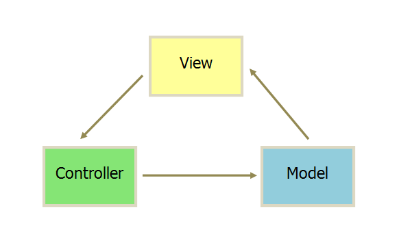

[详见：](http://www.ruanyifeng.com/blog/2015/02/mvcmvp_mvvm.html)
## MVC

MVC（Model View Controller 模型-视图-控制器）

::: tip 描述
Model：处理数据逻辑，负责在数据库中存取数据。

View：数据显示（依据模型数据）。

Controller：处理用户交互的部分，负责从视图读取数据，控制用户输入，并向模型发送数据。
:::

## MVP

::: tip 描述
1. 各部分之间的通信，都是双向的。

2. View 与 Model 不发生联系，都通过 Presenter 传递。

3. P层包含大量的DOM操作。
:::

## MVVM

MVVM 模式将 Presenter 改名为 ViewModel，基本上与 MVP 模式完全一致。唯一的区别是，它采用双向绑定（data-binding）：View的变动，自动反映在 ViewModel。

