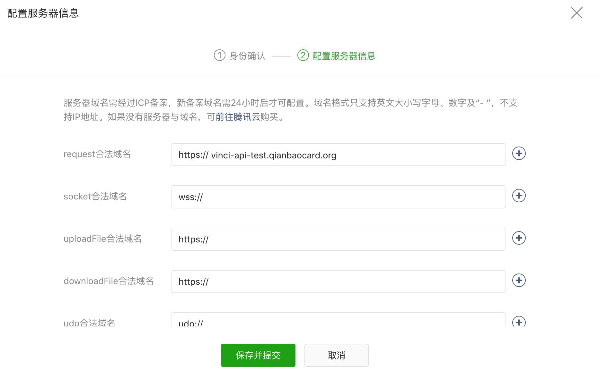

::: tip
1. 小程序顶部高度64px，底部高度48px，中间624px （iphone6）。
2. 域名只支持 https (wx.request、wx.uploadFile、wx.downloadFile) 和 wss (wx.connectSocket) 协议。并且须经过 ICP 备案，不能使用 IP 地址。每种类型的域名最多允许绑定20个。同一个域名只能绑定20个小程序。

3. 小程序实时日志只有上线发布后才可使用。
4. 自定义分析中的事件分析可以统计开发版的小程序中的事件但不能统计开发工具上触发的事件。使用分析和实时统计均只能在线上版本使用。
5. 小程序wxml中使用函数，只能使用wxs的语法，并且wxs不支持es6，不支持原生的js函数。
:::

## api

### wx.setNavigationBarColor 设置无效

原因：frontColor 和 backgroundColor 均为必填项，两个都需要，只设置其中一个会报错。

```js
wx.setNavigationBarColor({
  frontColor: '#ffffff',
  backgroundColor: '#000000'
})
```

## 其它

### 跳转h5

使用 web-view，并且只有使用web-view组件才能实现跳转 h5。

web-view组件：个人类型的小程序暂不支持使用。

跳转的 h5 链接需要在小程序管理后台配置业务域名。

```html
<!--自定义的Page页面嵌入h5页面-->
<view class="h5-container">
  <web-view src="https://www.baidu.com/"></web-view>
</view>

<!--触发页面-->
<navigator url="/pages/h5/h5">跳转到百度</navigator>
```