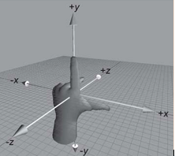
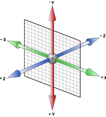

### 1.为页面所有元素添加轮廓线：

```js
[].forEach.call($$("*"), function(a) {
  a.style.outline =
    "1px solid #" + (~~(Math.random() * (1 << 24))).toString(16);
});
```

### 2.子元素设置absolute父元素无法撑开

设置绝对定位，子元素脱离文档流，无法实现撑开父元素。其与float不同，设置float的子元素，如果给父元素触发BFC，即可在计算时将floa的元素的高度也一并计算。

### 3.获取鼠标的键值

左键：0   滚轮：1  右键：2

```js
obj.onmousedown = function(e){
    console.log(e.button)
}
```
### 4.dependencies和devDependencies的区别：

devDependencies
里面的插件只用于开发环境，不用于生产环境

dependencies 是需要发布到生产环境的。

### 5.format中的HH和hh以及SS和ss的区别

HH：24小时格式

hh：12小时格式

SS：毫秒数

ss：秒数

### 6.JS中的严格模式

全局启用严格模式：

```js
"use strict";
console.log(this === window) // true
function test() {
    console.log(this === undefined) // true
}
```

[详见](https://www.jb51.net/article/118506.htm)

### 7.栅格系统

名称 | 大小(px) | 对应的设备
---|---|---
xm | <768 | 超小屏幕(手机)
sm | >=768 | 小屏幕(平板)
md | >=992 | 中等屏幕(桌面显示器)
lg | >=1200 | 大屏幕(大桌面显示器)
xl | >=1920 | 超大屏幕

### 8.等宽字体

```html
font-family: Consolas, Monaco, monospace;
  
// 例：使的 a 和 M 等宽
  <div>aaaaaa</div>
  <div>MMMMMM</div>
```
### 9.css 中的 step-start 和 step-end 的用法

用于animation-timing-function属性

首先：两者都可以看成是从一个点到另一个点的运动，
中间没有动画的过程，而是从一个点立即将效果跳转至另一个点。

当设置：

animation-timing-function:step-start; 会忽略第一个点

animation-timing-function:step-end; 会忽略最后一个点

例：

```css
#div1 {
    animation-timing-function:step-start;
}
@keyframes move {
	0% {left: 0;}
	33% {left:100px;}
	66% {left:200px;}
	100% {left: 300px;}
}
```
animation-timing-function:step-start; 0%时 的效果会被忽略，即整个动画过程不会显示 0% 时的状态。

animation-timing-function:step-end; 100%时的效果会被忽略，即整个动画过程不会显示 100% 时的状态。

例：实现 ... loading动画效果。

```js
// CSS代码：
@supports (display:none) {
      dot {
        display: inline-block; 
        width: 3ch;
        text-indent: -1ch;
        vertical-align: bottom; 
        overflow: hidden;
        animation: dot 3s infinite step-start both;
        font-family: Consolas, Monaco, monospace;
    }
}

@keyframes dot {
    33% { text-indent: 0; }
    66% { text-indent: -2ch; }
}
// HTML代码：
<a href="javascript:" class="grebtn">订单提交中<dot>...</dot></a>
```
### 10. 正则

#### 匹配中文 [\u4e00-\u9fa5]

```js
var reg = /^[\u4e00-\u9fa5]+$/
var str1 = 'a你好'
var str2 = 'abc'
var str3 = '你好'
console.log(reg.exec(str1)) // null
console.log(reg.exec(str2)) // null
console.log(reg.exec(str3)) // ["你好", index: 0, input: "你好", groups: undefined]
```
?= ^ $ 等字符匹配的都是位置，可以将位置理解为空字符。

```js
var result = "hello".replace(/(?=l)/g, '#');
console.log(result); 
// => "he#l#lo"

var result = /(?=he)^^he(?=\w)llo$\b\b$/.test("hello");
console.log(result); 
// => true
// 分析：(?=he)匹配的是he前的位置，可以理解为空字符
```

#### 匹配任意字符 [\d\D]、[\w\W]、[\s\S]和[^]

?: 和 ?= 都用于子表达式里面，?: 表示匹配且获取，?= 表示匹配但不获取。

```js
/1(?:2)/ 匹配12

/1(?=2)/ 匹配1，而且是后面有2的那个1
```

### 11. sessionStorage

1. a -> b (新窗口打开), b页面中包含a和b中设置的sessionKey，a页面只包含a中设置的sessionKey。
2. a -> b (共用同一个标签页)，b页面中包含a和b中设置的sessionKey，b返回a，a中包含a和b中的sessionKey。
3. 通过带target="_blank"的a标签、window.open等方式打开新窗口时，会把旧窗口（或标签）的sessionStorage数据带过去，但从此之后，新窗口（或标签）的sessionStorage的增删改和旧窗口已经没有关系了。即旧窗口中的sessionStorage不受新窗口的影响。
4. sessionStorage的session存在周期仅限当前标签页或者当前标签页打开的新标签页，通过其它方式新开的窗口或标签不认为是同一个session。

### 12. background

```css
background-position:50% 50%;

图片水平和垂直居中。与 background-position:center center;效果等同。

等同于x：{容器(container)的宽度—背景图片的宽度}*x百分比，超出的部分隐藏。
等同于y：{容器(container)的高度—背景图片的高度}*y百分比，超出的部分隐藏。

```
<p class="fg">background-size: cover;</p>

将图片等比缩放，直至宽或高能够覆盖给定的区域，因此可能会导致水平方向或竖直方向有部分图片被裁剪（只可能有一个方向上的图片会被裁剪）。

#### 保持图片缩放比

```js
// 1.图片完全显示，不裁剪，但给定的容器会出现部分空白区域
.wrap {
    width: 300px;
    height: 300px;
}
.image {
    width: auto;
    height: auto;
    max-width: 100%;
    max-height: 100%;
}

<div class="wrap">
  
</div>

// 2.竖直或水平方向完全显示，多余部分裁剪
// 如：容器为正方形，图片宽>高，高完全显示，宽裁剪。高>宽，宽完全显示，高裁剪。
.img {
    width: 300px;
    height: 300px;
    background: url(./a.png);
    background-size: cover;
}
<div class="wrap">
    <div class="img"></div>
</div>

// 3.水平方向完全显示，竖直方向裁剪或空白
.wrap {
    width: 300px;
    height: 300px;
    overflow: hidden;
}
.image {
    width: 300px;
}
<div class="wrap">
  
</div>
```
### 13. setTimeout的返回值问题

setTimeout中无法return一个值

解决办法：

1. 通过promise
2. 通过callback

```js
// promise
function getValue (val) {
  return new Promise(function (resolve, reject){
    setTimeout(() => {
      resolve(val)
    }, 1000)
  })
}
getValue(888).then(val => {
  console.log(val)
})

// callback
function getValue (val, callback) {
  return new Promise(function (resolve, reject){
    setTimeout(() => {
      callback && callback(val)
    }, 1000)
  })
}
getValue(888, function (val) {
  console.log(val)
})
```
### 14. 解决搜索时防止下一个请求在上一个请求之前返回


```js
data () {
    return {
        canSubmit: true
    }
},
...
getResult: function () {
    if (!this.canSubmit) return
    this.canSubmit = false
    get_merchant_list({
        ... // params
    }).then(res => {
        setTimeout(()=>{
      		this.canSubmit = true
      	},500)
      	if ((res.status+'').charAt(0) == '2') {
      		this.results = res.result.list
      		...
      	}
    })
}
```
### 15. 合并两个数组

```js
var arr1 = [1, 2]
var arr2 = [3, 4, 5]

// 方式一
var res1 = arr1.concat(arr2)

// 方式二
var s2 = [].push.apply(arr1, arr2)
console.log(arr1)

// 方式三
var s3 = [].unshift.apply(arr2, arr1)
console.log(arr2)

// 方式四
var s4 = [].splice.apply(arr2, [0, 0, ...arr1])
console.log(arr2)

// 方式五
var s5 = [].splice.call(arr2, 0, 0, ...arr1)
console.log(arr2)
```
### 16. 动画animation和过渡transition的区别

1. 过渡需要事件才能触发，动画可以自动运行。
2. 过渡只有起始和结束两种状态，而动画可以有多个状态(关键帧)。
3. 动画执行完成会回到起始状态。

附：可以设置animation-fill-mode: forwards，使动画停留在最后一个关键帧。
```js
animation-fill-mode : none | forwards | backwards | both;

值                 描述
none               不改变默认行为。
forwards           当动画完成后，保持最后一个属性值（在最后一个关键帧中定义）。
backwards          在 animation-delay 所指定的一段时间内，在动画显示之前，应用开始属性值（在第一个关键帧中定义）。
both               向前和向后填充模式都被应用。
```

### 17. 数组常用方法

<p class="fg">forEach</p>

返回值：undefined

用法：循环遍历数组，对于空数组不执行。

```
var arr = [1, 2, 3]
var sum = 0
arr.forEach(item => sum += item)
console.log(sum) // 6
```
<p class="fg">find</p>

返回值: 数组中符合条件的值 | undefined

用法：找到数组中第一个符合条件的元素。

例：

```
var arr = [{name: 'aa', value: 1}, {name: 'bb', value: 2}]
var res = arr.find(item => item.name === 'aa')
console.log(res) // {name: 'aa', value: 1}
```

<p class="fg">filter</p>

返回值：数组 | undefined

用法：获取数组中所有符合条件的元素构成的数组。

例：

```
var arr = [1, 2, 3, 4, 1]
var res = arr.filter(item => item === 1)
console.log(res) // [1, 1]
```
<p class="fg">map</p>

返回值：数组（空数组返回 []）

```
var a = [1, 2]
var res = a.map(item => ({value: item})) // [{value: 1}, {value: 2}]
```

<p class="fg">Array.from</p>

返回值：数组对象

参数：
1. 需要转化为数组的对象（具备length属性或可迭代对象）
2. 回调函数
3. 回调函数中this的指向

可迭代对象：对象或原型链上具备Symbol.iterator属性。

String，Array，TypedArray，Map 和 Set 都内置可迭代对象，因为它们的原型对象都有一个 Symbol.iterator 方法。
```js
// 例1：
var arr = Array.from([1, 2, 3], function (x) {
  console.log(this) // {}
  return x * 10
}, {});
console.log(arr) // [10, 20, 30]

// 例2：
var arr = Array.from([1, 2, 3], function (x) {
  console.log(this) // window
  return x * 10
});
console.log(arr) // [10, 20, 30]

// 例3：
var arr = Array.from([1, 2, 3], x => {
  console.log(this) // window,受箭头函数的影响
  return x * 10
}, {});
console.log(arr) // [10, 20, 30]
```
### 18. this 与 window

```js
function all (val) {
  console.log(val)
}
var obj = {
  test: function () {
    console.log(this === obj) // true
    // all.call(this, 'test') // test
    all('test') // test
  }
}
obj.test()
// 两种方式都是由window调用的。
// 原因：函数独立调用（不论这个函数在哪调用），this默认指向到window。
```
### 19. 跨域

1. html中带有src属性的，如img，script不受同源策略的影响，link中的href,a中的href。
2. window.name
3. h5的 postMessage
4. jsonp（只支持get请求）
5. document.domain + iframe
6. websocket（ws非加密和wss加密作为协议前缀）
7. CORS（跨源资源分享Cross-Origin Resource Sharing）

### 20. return的问题

return语句后不能有空行。
```js
function test () {
  return     
  1
}
console.log(test()) // undefined
```
### 21. 在函数前加分号和感叹号的原因：

```js
// 分号
;(function () {
    ...
})()
// 目的：避免压缩后由于前一个脚本最后没有添加分号导致压缩后的脚本不能使用

// 感叹号
!function () {
    ...
}()
// 使用一元运算符保证函数能够正常执行。+ 、 - 、 ~ 均可使用。
```
### 22. 异步

定义：不连续执行的任务，即先执行一部分任务，转而去执行其他任务，一会再回来继续执行。

#### 异步编程的方式

1. 回调函数
2. 事件监听
3. 发布/订阅
4. Promise 对象
5. Generator函数

所谓回调函数，就是把任务的第二段单独写在一个函数里面，等到重新执行这个任务的时候，就直接调用这个函数。

### 23. 函数作用域

```js
// 例1：
let a = 10
function test (a) {
  a = 20
  console.log(window.a) // undefined
}
test()
console.log(a) // 10
console.log(window.a) // undefined

// 例2：
let a = 10
function test (a) {
  a = 20
}
test()
console.log(a) // 20
```
函数参数拥有自己的局部作用域，修改函数参数的值时不会影响到全局变量。并且函数参数变量是默认声明的，所以不能用let或const再次声明。但可以用var再次声明。

```js
let a = 10
function test (a) {
  const a = 20
}
test()
// Uncaught SyntaxError: Identifier 'a' has already been declared
```
### 24.Form Data 和 Request Payload 区别

如果请求头里设置Content-Type: application/x-www-form-urlencoded，那么这个请求被认为是表单请求，参数出现在Form Data里，格式为key=value&key=value&key=value...

原生的AJAX请求头里设置Content-Type:application/json，或者使用默认的请求头Content-Type:text/plain;参数会显示在Request payload块里提交。

### 25.content-type 的常见类型

::: tip 类型
1.application/x-www-form-urlencoded

(1)浏览器的原生form表单。

(2)提交的数据按照 key1=val1&key2=val2 的方式进行编码，key和val都进行了URL转码。

2.multipart/form-data

用于上传文件时设置。

3.application/json

4.text/plain | text/html | text/xml
:::

### 26.调试工具

1. 正常情况下，选中元素时显示的元素宽高等于元素内容的宽高和padding之和。

### 27.css 3d 坐标轴

几何坐标轴：



css 3d 坐标轴：



### css 阻塞

1. css加载不会阻塞DOM树的解析。
2. css加载会阻塞DOM树的渲染。（DOM树解析完成但未显示在页面上）
3. css加载会阻塞后面js语句的执行。

