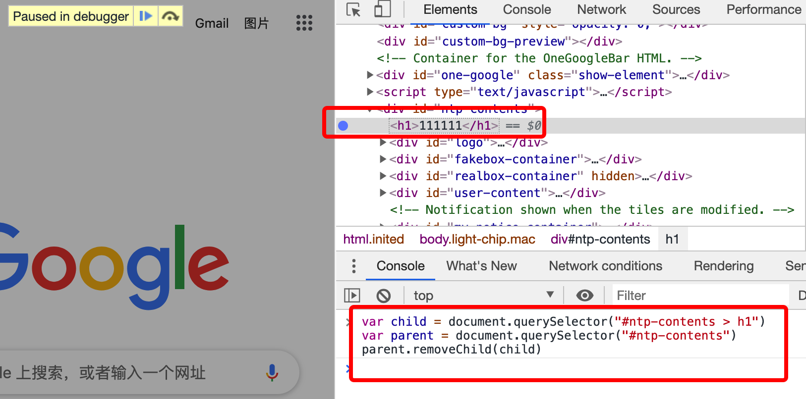

## 常见用法

[参考1](https://segmentfault.com/a/1190000021158037)
[参考2](https://segmentfault.com/a/1190000016841971)

### 查看hover后出现的元素样式

先打开调试 -> hover当前元素 -> 右键弹出弹框，不点击鼠标 -> 鼠标移动至调试面板（elements）-> 按下N键会自动定位到当前hover的元素

### console.table

```js
var arr = [{name: 'aa', age: 10}]
console.table(arr) // 浏览器的console中将以table的形式显示arr
```

### document.body.contentEditable

在浏览器的console中设置 document.body.contentEditable = true，整个浏览器中的内容将可以被编辑。

或设置 document.designMode='on';（控制整个文档是否可编辑。有效值为 "on" 和 "off" 。根据规范，该属性默认为 "off" 。）

### 选择DOM元素

Chrome控制台输入：

1. $(selector)：返回匹配指定CSS选择器的DOM元素的第一个引用，相当于document.querySelector()函数。
2. $$(selector)：返回匹配指定CSS选择器的DOM元素数组，相当于document.querySelectorAll()函数。
3. $x(path)：返回一个与给定XPath表达式匹配的DOM元素数组。

```
例：$x('//p[a]')表示返回包含<a>元素的所有<p>元素。
```

### 获取console中前一个输出的值

使用 _$获取。

```js
1 + 2 + 3 + 4 // -> 10

$_ // -> 10

$_ * $_ // -> 100

Math.sqrt($_) // -> 10

$_ // -> 10
```

### 获取DOM元素上注册的监听器

使用 getEventListeners($('selector'))

### 监听DOM元素上注册的监听器

使用  monitorEvents($('selector'))

1. monitorEvents($('selector')): 监听所有事件。
2. monitorEvents($('selector'), 'eventName'): 监听特定的事件。
3. monitorEvents($('selector'), [eventName1, eventName2, ...]): 监听多个事件。
4. unmonitorEvents($('selector')): 停止监视选择器匹配的元素关联的所有事件。

### 检查DOM元素

使用inspect()方法让我们可以直接从控制台中检查一个DOM元素。

inspect($('selector'))：将检查与选择器匹配的元素，并且会自动跳转到Chrome Developer Tools的Elements选项卡中。即跳转到指定位置的元素中。

### 标记DOM元素

在 Elements 中点击想要选择的DOM元素，控制上输入 $0 即可获取刚才点击的DOM元素。

1. Chrome 检测器会保留其历史记录中的最后 5 个元素，即只有最后点击的 5个元素能够被获取到。
2. 第一个点击的使用 $4 获取，最后一次点击的使用 $0 获取。
3. 只有 $0、$1、$2、$3、$4 是有效的。

### 获取函数的堆栈跟踪信息

使用 console.trace() 追踪。

```js
function f1() {
  f2()
}
function f2() {
  f3()
}
function f3() {
  console.trace();
  console.log('哈哈哈')
}
f1()

/**
console.trace
f3 @ (index):84
f2 @ (index):81
f1 @ (index):78
(anonymous) @ (index):87
*/

```

### console.log的格式化打印

1. %s：字符串占位符
2. %d：整数占位符
3. %f：浮点数占位符
4. %o：对象占位符(注意是字母o，不是数字0)
5. %c：CSS样式占位符

```js
console.log('%c%s%s%s', 'color: yellow;', '–', 1234, '–');
console.log('%c%s%s%s', 'color: skyblue;background-color:pink', '–', 1234, '–');
```

### 监听函数的调用和函数参数

在 Chrome 控制台中，可以使用 monitor() 监听指定函数，每次调用该函数时，都会对传入的参数值进行记录。

```js
function f(a, b){console.log(a + b)}
monitor(f)
f(1, 2)
// function f called with arguments: 1, 2
// 3
```

### 使用调试工具截屏

mac： alt + command + i 打开调试

使用快捷键：command + shift + p 输入 screenshot

当前区域截图：选择 Capture area screenshot

长截图：选择 Capture full size screenshot


## 必备技巧

### 调试工具快捷键

:::tip

1. 调试工具中的elements中可以使用复制粘贴，也可以直接拖拽节点到其它位置。
2. esc呼出一个console面板。
3. css设置的颜色，点击颜色可以弹出颜色面板，设置颜色。也可以吸取页面的颜色。
4. 显示的盒模型中可以修改 margin，border 和 padding。

:::

用途|mac快捷键
----|----
打开最近关闭的状态|command + option + i
快速查看DOM|command + option + c
快速进入console|command + option + j
调试窗口位置切换|command + shift + d
搜索DOM中的内容|command + f

###  获取dom元素的方式

1. 在elements中选中元素后，使用 $0 输出选中的元素
<br/>


2. elements中选中元素 -> 右键 -> Copy -> Copy JS path

### dom节点打断点操作

elements中选中元素 -> 右键 -> Break on

用于监听子树修改，属性修改和节点移除动作是否生效。

<br/>



### 新增css类和样式

点击 “+” 新增css类，设置样式，点击 inspector-stylesheet 可以拷贝新增的样式。
<br/>


### 元素样式调节

选中样式右下角的三个小点，可以给选中的元素设置 text-shadow box-shadow color 和 background-color。
<br/>


### console 的使用

console.table([{a:1, b:2}, {a: 2, b:3}, {c: 1, d:2}])


```js
var fabonacci = function (n) {
  return n < 3 ? 1 : fabonacci(n - 1) + fabonacci(n - 2)
}
console.time()
fabonacci(5)
console.timeEnd()
// default: 0.010009765625ms
```

## Source

### js 断点

断点时可以直接在 console 中输出对应函数中的变量。

1. 代码中添加debugger

```js
function calc () {
  var val1 = input[0].value
  debugger
  var val2 = input[1].value
  result.innerHTML = val1 + val2
}
```

2. 直接在source中添加断点


3. 监听事件，触发指定事件时自动 pause


### snippets（代码片段）

可用于加载一个js包，例如 jquery，用于调试页面


```js
var script = document.createElement('script')
script.src = 'https://cdn.bootcss.com/jquery/3.4.1/jquery.js'
// script.crossOrigin = 'anonymous'
document.head.appendChild(script)
```

### Filesystem

1. 修改引入的 css 内容会实时生效，但修改 index.html 中的内容需要刷新浏览器后才会生效。
2. 修改后本地的文件也会被修改。
3. 在编译器中新编辑的内容可以被撤销。


## Network

### filter

两个的区别：

1. 在filter中可以过滤请求的名称等。
2. 使用 command + f 可以过滤请求的header，request，response等内容。


