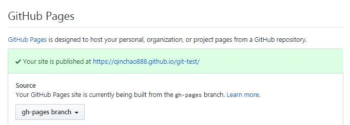

<a class="fb_t" href="https://www.liaoxuefeng.com/wiki/0013739516305929606dd18361248578c67b8067c8c017b000">推荐学习地址1</a><OutboundLink/>

<a class="fb_t" href="https://segmentfault.com/a/1190000022491558">推荐学习地址2</a><OutboundLink/>

## 常用命令

```
pwd //查看当前目录

ls -ah //查看当前目录下的文件，包含.git文件

git init // 初始化一个空的git仓库

# 新建一个目录并初始化一个git仓库
git init project

git status //查看当前哪些文件被修改

git diff //即查看difference，可以查看哪些内容被修改

git log //查看提交的历史记录

git log --pretty=oneline //每条历史只显示一行，反馈结果包含commit id（版本号）
该版本号用一串16进制数表示，目的是为了解决多人开发造成版本号冲突。

git diff HEAD -- 文件名 //查看某个版本下某个文件修改的情况

git diff HEAD^ -- 文件名
//查看上个版本修改的内容

git diff 版本号 -- 文件名 //根据版本号查看修改内容

git checkout -- 文件名 //丢弃工作区的修改

git checkout . // 撤销工作区所有的修改

git rebase //把本地未push的分叉提交历史整理成直线

git add -f dist //强制提交被.gitignore忽略的文件

git branch -m dev develop //分支改名

cat README.md //查看文件内容

rm -rf .git //删除本地仓库

git push origin master -f //远程推送失败(强制推送)

git remote add origin git地址 //远程连接

git clone git地址 //克隆项目

git checkout 分支名 //切换分支

git branch 分支名 //创建新分支（必须置于commit之后）

git branch -d dev //删除本地分支

git push origin -d dev //删除远程分支

git config user.name //查看用户名

git config user.email //查看邮箱

git rm 文件名 // 删除文件

git add 文件夹名称 // 上传文件夹

git rm 文件夹名称 -r // 删除文件夹
```

### git config

```
----

# 查看git的配置
git config --list

credential.helper=osxkeychain
user.name=qinchao888
user.email=2164109314@qq.com
core.editor=code --wait

----

# 编辑项目所属的配置文件
git config -e --local

# 查看项目所属的配置文件
git config --local -l

[core]
	repositoryformatversion = 0
	filemode = true
	bare = false
	logallrefupdates = true
	ignorecase = true
	precomposeunicode = true

----

# 编辑全局的git文件
git config -e --global

# 查看全局的git文件
git config --global -l

[user]
	name = qinchao888
	email = 2164109314@qq.com
[core]
	editor = code --wait

----

# 优先级
git config > git config --global > git config --system

----

# 配置 vscode 为 git 的默认编辑器
git config --global core.editor "code --wait"

warning: core.editor has multiple values
error: cannot overwrite multiple values with a single value
       Use a regexp, --add or --replace-all to change core.editor.

# 报错：可能存在多值冲突，使用 --replace-all
git config --global --replace-all core.editor "code --wait"

----
```

### git show

```
# 查看某次提交的元数据和内容变化
git show [commit]

# 查看某次提交变更的文件
git show --name-only [commit]

# 查看某次提交时指定的文件中的所有内容
git show [commit]:[filename]
```

### git help

```
# 可用命令
git help

# 所有可用命令
git help -a 

# 指定的命令
git help add
git help commit
git help init
```

### git log

```
# 查看当前分支最近的几次提交
git reflog

# 查看所有提交
git log

# 查看某几条提交信息
git log -n 10

# 查看仅合并提交的信息
git log --merges

# 查看每次详细修改内容的diff
git log -p <file>

# 查看最近两次详细修改内容的diff
git log -p -2

# 查看提交统计信息
git log --stat

# 查看当前修改的详细信息
git diff --stat
```

### git mv

```
# 重命名
git mv test.js test2.js

# 移动
git mv test.js ./new/path/test.js
```

### git tag

```
# 查看所有tag
git tag

# 新建一个tag在当前commit
git tag [tag]

# 新建一个tag在指定commit
git tag [tag] [commit]

# 删除本地tag 
git tag -d [tag]

# 查看tag信息
git show [tag]

# 删除远程tag
git push origin :refs/tags/[tag]

# 提交指定tag到远程
git push origin [tag]

# 提交所有tag到远程
git push origin --tags
```

## 基本操作

### 撤销master分支上的提交

（类似于版本回退）

git revert 命令意思是撤销某次提交。它会产生一个新的提交，虽然代码回退了，但是版本依然是向前的。

连续执行两次revert HEAD命令，等同于没执行。

```
git revert HEAD    // 撤销最近一次提交
git revert HEAD~1  // 撤销上上次的提交，注意：数字从0开始
git revert 0ffaacc // 撤销指定的commit_id
```

### merge远程分支

```
git merge远程分支 git merge origin/feature/qinchao/v1
不可写成 git merge origin feature/qinchao/v1
```

### 使用远程release分支的代码覆盖本地devp分支的代码

```
git checkout devp
git reset --hard origin/release
git add -A
git commit -m 'reset to release'
git push -f // 强推
```

### 首次提交

```
git push -u origin master
// 建立本地 master 分支与远程 master 分支的连接
```

### 代码合并

<p class="fg_t">例：将本地分支：feature/abc/v1 代码推送至远程分支：feature/v1 上</p>

```
1. git branch -a // 查看是否存在远程分支remotes/origin/feature/v1,不存在执行2

2. 
  方式一: git fetch // 抓取远程分支
  方式二: git checkout -b feature/v1 origin/feature/v1(创建新分支并建立与远程分支的连接)

3. git checkout feature/v1 // 切换分支

4. git pull // 拉取远程分支 feature/v1 代码至本地 
// 若拉取失败，说明未建立连接，执行git branch --set-upstream-to feature/v1 origin/feature/v1
 
5. git merge feature/abc/v1  //合并分支
// 若有冲突，git status查看发生冲突的文件，手动解决冲突。

6. git push
```
### 切换至master分支报错

::: danger 错误信息
error: pathspec 'master' did not match any file(s) known to git
:::
原因: 本地不存在 master 分支。
```
// 解决办法
git branch -a // 查看分支

git fetch // 抓取远程分支至本地

git checkout master
```
### git bash 界面无法操作

<p class="fg_t">例1：merge时报错?</p>

::: danger 错误信息
Please enter a commit message to explain why this merge is necessary.
:::
此时界面无法操作，输入:wq 即可。

[详见](https://www.cnblogs.com/wei325/p/5278922.html)

<p class="fg_t">例2：如何退出git log 或 git show?</p>

按下英文状态的 "q" 键即可。

<p class="fg_t">例3: git bash无法输入内容。</p>

此时终端实际上是可以输入内容的，只是看不到，解决办法：
```
//输入
reset 回车 //具有清屏效果
```
### 代码恢复

<p class="fg_t">例：误删本地分支和远程分支导致代码丢失，如何恢复？</p>

```
git reflog // 查看分支操作历史

git branch <branch_name> HEAD@{4} // 恢复指定的分支
```

### git stash 的应用

需求：从远程分支上拉到本地的master分支，直接修改master分支上内容发现应该在新分支上应用修改并且撤销对master分支修改。

```
//情形一：只有工作区修改，未进行git commit操作

git stash // 存储工作区修改
git checkout -b feature/new/v1 // 从master分支上切出新的分支
git stash list // 查看现有的储藏
git stash pop // 应用最新的储藏并清除当前的储藏

// 情形二：进行了git commit操作并且又有新的修改未提交

git reflog // 查看历史
git reset --soft [commit_id] // 回退到commit之前的那个版本并且保留所有修改
git stash // 存储所有修改
git checkout -b feature/new/v1
git stash pop // 应用先前在master分支上的所有修改
```

git stash 只能暂存修改的文件，不能暂存新增的文件，如果需要暂存新增的文件，使用 git stash -a 即可。

### 报错信息

<p class="fg_t">例1：git pull 提示 no tracking information。</p>

原因：本地分支和远程分支的连接关系没有创建，执行命令：
```
git branch --set-upstream-to dev origin/dev

//附：创建远程origin的dev分支到本地

git checkout -b dev origin/dev

//这样本地的dev分支就和远程的dev分支建立连接

```
### 版本回退(不区分大小写)

**前提：未推送到远程**
```
当前版本：HEAD。

上一个版本：HEAD^。

上上个版本：HEAD^^。

往上100个版本： HEAD~100

//回退到上个版本
git reset --hard HEAD^
```
### 版本恢复

恢复到回退前的版本就必须知道之前版本的版本号。通过git reflog查看你使用过的每一个命令：

```
git reflog //可以获取之前版本的commit id

git reset --hard commit_id //恢复到之前的版本
```
### 撤消工作区修改

1. readme.txt自修改后还没有被放到暂存区，现在，撤销修改就回到和版本库一模一样的状态；

2. readme.txt已经添加到暂存区后，又作了修改，现在，撤销修改就回到添加到暂存区后的状态
```
git checkout -- readme.txt
```
### 撤销暂存区修改

```
git reset HEAD readme.txt // 此时回到工作区

git checkout -- readme.txt // 撤销工作区修改
```
### 删除版本库中的文件

```
git rm 文件名

git commit -m "delete"

//误删文件恢复
git checkout -- 文件名

```
git rm相当于在工作区删除文件，因此使用git checkout可以撤销对工作区的操作，但文件只能恢复到最后一次提交前的状态。

### 连接远程
```
git remote add origin git地址 //关联远程仓库

git push -u origin master //第一次推送master分支的所有内容

git push origin master //此后推送最新修改
```
### 解决冲突

```
//master分支修改readme内容
git checkout master
git add readme.txt
git commit -m 'modify'

//dev分支修改readme内容
git checkout dev
git add reaadme.txt
git commit -m 'modify'

//merge
git checkout master
git merge dev //出现冲突

1.打开冲突文件，会自动标出冲突位置，如：
<<<<<<< HEAD
Creating a new branch is quick & simple.
=======
Creating a new branch is quick AND simple.
>>>>>>> dev
手动修改此处的内容
2.git add readme.txt
3.git commit -m "merge"

//此时master分支已解决冲突，dev分支直接通过：
git merge master即可
```
### Fast forward模式

合并分支时，如果可能，Git会用Fast forward模式，但这种模式下，删除分支后，会丢掉分支信息。

要强制禁用Fast forward模式，Git就会在merge时生成一个新的commit，这样，从分支历史上就可以看出分支信息。

使用--no-ff禁用Fast forward模式
```
git merge --no-ff -m "merge with no-ff" dev
//此次合并生成一个新的commit，因此需要添加commit的描述
```
形如：


使用Fast forward模式：


### 修复Bug分支
现在在dev分支上开发，但代码未提交，需要切换到master分支上去修复Bug。

修复bug时，我们会通过创建新的bug分支进行修复，然后合并，最后删除。
```
git stash   //储存当前工作状态

git status  //working tree clean

git checkout master //创建临时分支解决冲突

git checkout -b temp //修改冲突

git add readme.txt

git commit -m 'fix bug'

git checkout master

git merge --no-ff -m 'bugfixed' temp

git branch -d temp //删除临时分支

git checkout dev //切换回原分支

git stash list //查看之前存储的工作状态

//状态恢复的两种方式：
1. git stash apply, 但stash内容并不删除，需要用git stash drop删除

2. git stash pop，恢复的同时把stash内容也删了

//可以多次stash，恢复的时候，先用git stash list查看，然后恢复指定的stash
git stash apply stash@{0}
```
### 删除feature分支

```
git checkout -b feature/v1 //创建一个新分支

git add readme.txt

git commit -m "new" //添加新功能

git checkout master

//feature/v1分支多余，需删除

git branch -d feature/v1 //报错

git branch -D feature/v1 //强行删除即可
```
### 多人协作

远程仓库名称： remote

```
git remote // 查看远程库信息

git remote -v //查看详细信息
origin  git@github.com:michaelliao/learngit.git (fetch)
origin  git@github.com:michaelliao/learngit.git (push)
//显示了可以抓取和推送的origin的地址。如果没有推送权限，就看不到push的地址。
```
### 创建标签

```
git tag v1.0 //v1.0标签会打在最新的commit上

git tag //查看所有标签

git tag v0.9 f52c633 //针对具体的commit id打tag

git show v0.9 //查看具体的标签信息

git tag -a v0.1 -m "version 0.1 released" 1094adb //创建带有说明的标签，用-a指定标签名，-m指定说明文字

git tag -d v0.1 //删除标签

git push origin v1.0 //推送某个标签至远程

git push origin --tags //一次性推送全部尚未推送至远程的本地标签

//删除远程的tag
git tag -d v0.9 //先删除本地的tag
git push origin :refs/tags/v0.9
```
### 删除远程文件
```
/*先直接删除本地*/
git status/*自动检测到删除操作*/
git commit -am "delete file"
git push/*推送至远程并执行删除操作*/
```
### 项目开发流程
每次提交代码前先：
```
git pull origin 分支名
```
每次删除文件或修改文件：
```
git add 删除的文件或修改的文件
git commit -m "修改内容"
git push origin 分支名
```
出现冲突无法解决时使用远程代码覆盖本地:
```
git fetch
git reset --hard origin/develop
git pull origin develop
```
#### 冲突


原因：分支名冲突，temp/v1与temp冲突

解决办法：重新创建一个分支，再push

```
git checkout -b newBranch

git push
```
### 本地创建 sshkey

```
ssh-keygen –t rsa –C qinchao@qianbaocard.com

找到生成的.ssh文件夹，打开id¬_rsa.pub,复制里面的key。添加到远程的ssh key中。

检测是否设置成功：

ssh git@gitlab.qianbaocard.org

设置提交代码时的用户信息

git config [--global] user.name "[name]"

git config [--global] user.email "[email address]"

查看用户信息：

git config user.name

git config user.email
```
### 本地仓库与远程的gitLab和gitHub连接

```
配置sshKey

git remote add gitlab 远程仓库名

git remote add github 远程仓库名

//非git remote add origin 远程仓库名

git remote -v //查看连接的远程仓库

//推送代码
git push gitlab master
git push github master
```

## 其它

### 命令区别

::: tip 区别
<p class="fb_t">git commit -am 和 git commit -m：</p>

git commit -am 可以看成是 git add 和 git commit -m

<p class="fb_t">git fetch和 git pull：</p>

git pull 等同于 git fetch 和 git merge

<p class="fb_t">git checkout -b dev：</p>
等价于 git branch dev 和 git checkout dev

<p class="fb_t">git init</p>
输出: Initialized empty Git repository in .../.git/

作用: 初始化一个空的 git 仓库。

默认该 .git 目录是隐藏的，使用 <span class="fg_t">ls -ah</span> 查看。
:::
（1）git中默认分支为master,禁止删除，如果要删除的话需修改当前的默认分支。

Settings->Branches->Default branch

（2）.gitignore:版本管理时过滤一些文件

### 文件部署

将 js 文件部署到 github 上(直接部署在master分支上的js文件引入项目中是无效的)。

步骤：

(1) 创建 gh-pages 分支，上传 js 文件。

(2) git 项目中 settings



js 文件地址：<span class="fg_th">https://qinchao888.github.io/git-test/文件名.js</span>