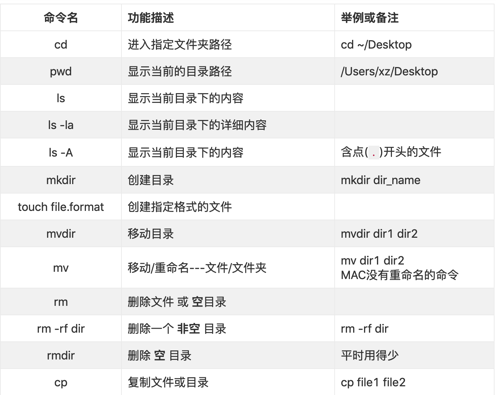
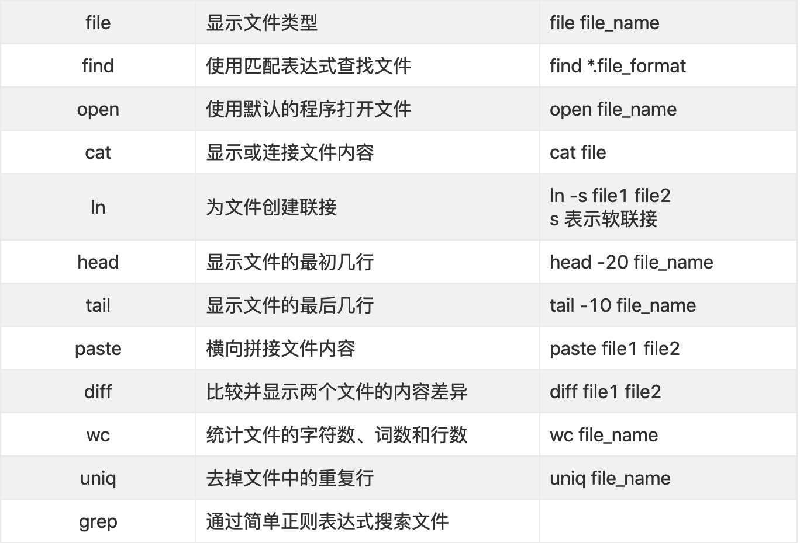
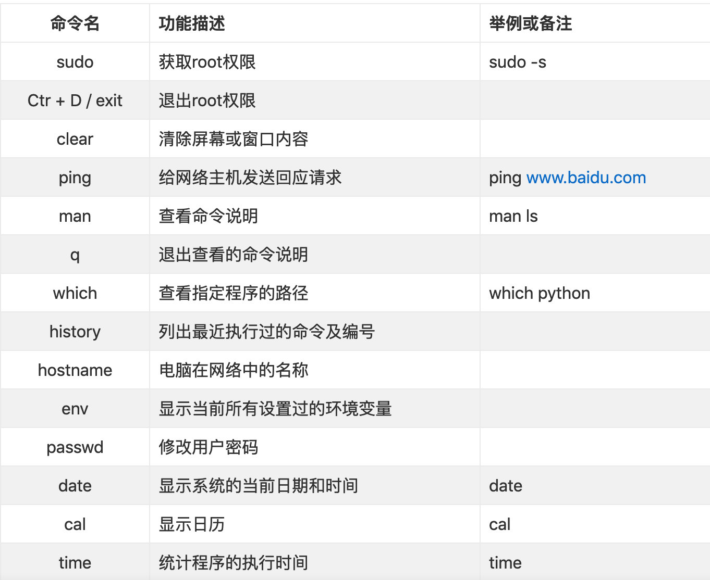

## 基础用法

### grep

正则

#### 常见参数

```js
-A num  // 打印出找到的匹配行后num
-B num  // 打印出找到的匹配行前num行
-C num  // 打印出找到的匹配行前后num行, 相当于-A num -B num
-c      // 统计出匹配的总行数，同一行有两个匹配也只算一行
-H      // 在每一行前面打印出匹配的文件名，在多个文件的情况下这个是默认选项
-h      // 在多个文件的情况下不打印出匹配的文件名
-n      // 打印出匹配所在行的行数
-i      // 查找时忽略大小写
-v      // 打印出不匹配的行
-w      // 只匹配整个单词
--color // 匹配的字符高亮
/** never: 从不使用颜色表示不同类型
 * always:总是使用颜色表示不同类型
 * auto:  根据终端属性自动确定是否使用颜色表示不同类型 */
```
```js
// 例
// info 文件
start
this is first line
this is second line
this is last line
end

>grep -A1 second info
this is second line
this is last line

>grep -B1 second info
this is first line
this is second line

>grep -C1 second info
this is first line
this is second line
this is last line

>grep -c line info
3

>grep this info test // 等价于 grep -H this info test
info:this is first line
info:this is second line
info:this is last line
test:this is a test

>grep -h this info test
this is first line
this is second line
this is last line
this is a test

>grep -n line info
2:this is first line
3:this is second line
4:this is last line

>grep -v this info
start
end

>grep --color=never line info // 没有高亮颜色
>grep --color=auto line info 
>grep --color=always line info // 有高亮颜色
```

### 命令行操作

| 命令   |      描述     |
|----------|:-------------:|
| history | 查看操作历史 |
| ps | 查看当前终端运行的程序 | 
| ps ax | 列出这台电脑上正在运行的所有程序 |
| kill [PID] | 结束指定进程ID的进程 |
| sudo kill -9 [PID] | 强制结束进程 |
| ls\|more | 将ls的结果一行一行显示 |
| ifconfig | 查看ip地址和mac地址 |






### 快捷键

| 快捷键   |      描述     |
|----------|:-------------:|
| command + k |  清屏 |
| shift + command + z |   撤销恢复  |
| control + space + 输入terminal | 启动终端 |
| command + n | 打开新窗口 |
| fn+上键 | page up	|
| fn+下键 | page down |
| command + tab| 切换任务栏	 |
| ctrl + D | 退出命令行 |
| control + s | 保存 |
| control + x | 退出 |
| command + r | 刷新浏览器 |
| option + command + i | 打开调试工具 |
| CTRL+A | 移动光标至行首 |
| CTRL+E | 移动光标至行尾 |
| ESC+B | 光标向左移动一个单词 |
| ESC+F | 光标向右移动一个单词 |
| CTRL+U | 删除光标前所有字符 |
| CTRL+K | 删除光标后所有字符 |
| CTRL+W | 删除光标前一个单词（根据空格识别单词分隔） |
| CTRL+Y | 粘贴之前（CTRL+U/K/W）删除的内容 |
| CTRL+C | 中断操作 |

### 文件

#### .DS_Store文件

.DS_Store(英文全称 Desktop Services Store)是一种由苹果公司的Mac OS X操作系统所创造的隐藏文件，目的在于存贮目录的自定义属性，例如文件们的图标位置或者是背景色的选择。

只要打开 finder 就会生成.DS_Store文件。

```js
// 添加.gitignore过滤掉该文件

# 此为注释 – 将被 Git 忽略
.DS_Store
```

#### 重启访达

killall Finder 

### 常用命令

#### 配置命令行文件路径

```
nano .zshrc

// https://git.grml.org/?p=grml-etc-core.git;a=blob_plain;f=etc/zsh/zshrc;hb=HEAD
copy内容至 .zshrc中

// 其他环境变量的配置
nano .zshrc.pre
```
1. bash_profile和.zshrc都在用户目录下(~)
2. .bash_profile需要使用source执行下，方可生效(可能需要手动创建.bash_profile)
3. .zshrc修改环境变量，保存修改重启终端即可（需要安装oh-my-zsh自动创建.zshrc，直接手动创建.zshrc没有用）

```
$ sudo scutil --set ComputerName qinchao@macbook
$ sudo scutil --set HostName newHostName

// 查看
$ scutil --get ComputerName
$ scutil --get HostName
```