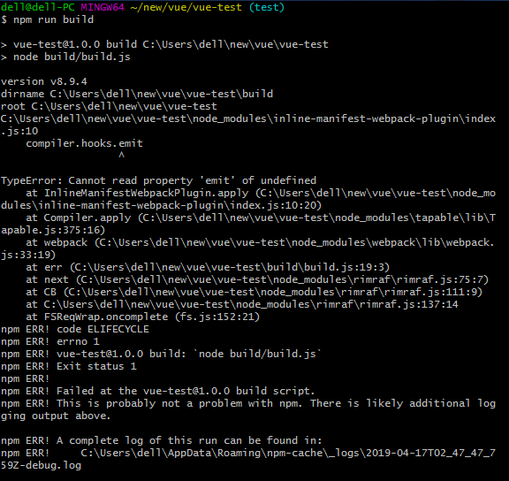

## npm run build

打包后生成的 app.js、vendor.js、manifest.js 的作用：

<span class="fb_t">app.js</span>：即对应 app.vue。

<span class="fb_t">vendor.js</span>：项目中引入 node_modules 中的依赖包。(一般较大200kb左右)

<span class="fb_t">manifest.js</span>：存储了 chunks 映射关系。（必须最先加载，否则后续引入的文件无法映射成正确的地址）。

## manifest.js

默认 npm run build 后生成的 manifest.js 文件会通过 script 标签引入，浪费一个请求。因此可以通过配置将生成的 manifest.js 的代码直接嵌入 index.html 中。

<p class="fg">项目中使用 vux 配置</p>

```js
// webpack.base.conf.js
const webpackConfig = {...}
const vuxLoader = require('vux-loader')
module.exports = vuxLoader.merge(webpackConfig, {
  plugins: ['inline-manifest', 'vux-ui', 'duplicate-style']
})
```
```html
<!--index.html-->
<body>
  <div id="app"></div>
  <%=htmlWebpackPlugin.files.webpackManifest%>
</body>
```
<p class="fg">未使用 vux 配置</p>

安装 inline-manifest-webpack-plugin

```js
// 此时只支持 webpack4.0+
npm install inline-manifest-webpack-plugin --save-dev
```

```js
// webpack.prod.conf.js
const InlineManifestWebpackPlugin = require('inline-manifest-webpack-plugin')
plugins = [
  // ...
  new webpack.optimize.CommonsChunkPlugin({
    name: 'manifest',
    minChunks: Infinity
  }),
  new InlineManifestWebpackPlugin()
]
```
<p class="fr">报错</p>



<span class="fr">原因：</span>当前安装的 webpack 版本与 inline-manifest-webpack-plugin 所需版本不一致。 若 webpack 版本为 3.0，则安装：

```js
npm install --save-dev inline-manifest-webpack-plugin@3.0.1 // 即可
```